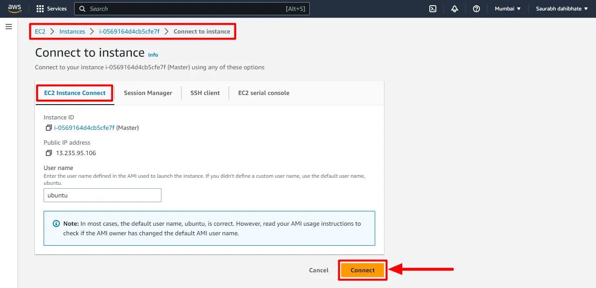
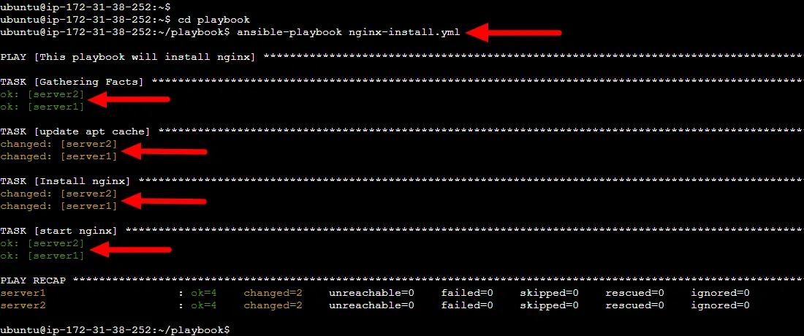

# Ansible deployment
Automating a Website Protection Web App Deployment Using Ansible on AWS EC2 Instances.


## 🚀 Project Overview
This project involves setting up and deploying a simple web application using Ansible by automating various tasks. Key steps include creating EC2 instances on AWS, installing Ansible on the host server, copying the necessary SSH keys, setting up an inventory file, and writing a playbook to install and configure Nginx. The project aims to execute these steps efficiently to set up a working environment where a sample web page can be deployed and accessed through the public IPs of the EC2 instances.


## 🔧 Problem Statement
automate the deployment of a simple web application on AWS EC2, ensuring scalability and efficient management of resources through Ansible, thereby reducing manual setup efforts and potential human errors. Given Ansible's industry-wide adoption for its simplicity and effectiveness in configuration management and automation, this project seeks to leverage these capabilities to streamline cloud operations and enhance productivity.


## 💽 Techonology Stack
- ● **AWS EC2**: Virtual servers in the cloud for running applications.
- ● **Ansible**: Automation tool for configuration management and application deployment.
- ● **Nginx**: Web server to serve the web application.
- ● **GitHub**: Source control to manage and store playbook and application files.
- ● **SSH**: Secure protocol for managing machines over a network.
- ● **YAML**: Language used for writing Ansible playbooks.
- ● **.pem Keys**: Private keys for secure access to AWS EC2 instances.


## 📌 Architecture Diagram


## 📋 Table of Contents

- [Step-1: Create EC2 instances](#step-1-create-3-EC2-instances)
- [Step-2: Install Ansible in Host Server](#step-2-install-ansible-in-host-server)
- [Step-3: Copy SSH Key](#step-3-transferring-private-SSH-key-to-the-ansible-controller-server)
- [Step-4: Create a playbook to install Nginx](#step4-create-playbook-to-install-nginx)
- [Step-5: Deploy a sample webpage using the ansible playbook](#step5-deploy-webpage-using-playbook)
- [Step-6: Cleanup](#step-6-cleanup)


## 🚦 Getting Started

### 🌟 Prerequisites
- **AWS Knowledge**: Familiarity with Amazon Web Services, specifically EC2 instances.
- **Ansible Experience**: Basic understanding of Ansible for automation and its playbook syntax.
- **Linux/Unix Skills**: Comfortable with command-line operations, SSH, and system administration.
- **Programming**: Basic knowledge of YAML for writing Ansible playbooks.
- **Version Control**: Experience using Git, specifically GitHub, for source code management.
- **Networking**: Understanding of network configurations, including IP addressing and DNS.
- **Security**: Knowledge of secure key management and file permissions in Unix/Linux environments.


## ✨ **step-1-create-3-EC2-instances**
- Log into the AWS Management Console.
- Navigate to the EC2 Dashboard and click on **Launch Instances**.
- Select the Ubuntu Server AMI from the list of available AMIs.
- Choose the instance type suitable for your needs.
- Configure instance details, and set the number of instances to 3.
- Select or create a key pair for SSH access, ensuring the same key is used for all 3 instances.
- Create a security group that allow HTTP and SSH traffic as below:

- Review your settings and launch the instances.


- Select and rename one instance as a `controller` (master) server and other two as node server.


## 🌟 **step-2-install-ansible-in-host-server**
- Connect to your host server via SSH or any remote access method.



- Add the Ansible PPA repositoryand update packages using the following command:
```bash
  sudo apt-add-repository ppa:ansible/ansible
  sudo apt update
```


- Install Ansible using the following command:
```bash
  sudo apt install ansible
```


- Once the installation is complete, you can check the version of Ansible using the following command:
```bash
  ansible --version
```


## 🌟 **step-3-transferring-private-SSH-key-to-the-ansible-controller-server**

- After deploying the 3 EC2 instances earlier with the same key, you have downloaded the private key to your local computer, likely in the Download folder. Locate that private key with the following command:
```bash
  cd ~/Downloads
  ls *.pem
```

- Open and copy `.pem` private key file from local using the command below:
```bash
  cat ansible-key.pem
```


- To proceed with the setup, copy the content of the private key from your local (laptop) to the Ansible controller node (ansible_master) by creating a new file at `/home/ubuntu/.ssh` and pasting the private key in that file.


- Give permissions to the private key file using chmod command.
```bash
  sudo chmod 600 ansible-key
```


### **Access the inventory file using sudo vi `/etc/ansible/hosts`**

- Create inventory file at location `/etc/ansible/hosts` which is by default location of file. Ansible hosts file is a configuration file that contains a list of hosts or servers. Add the IP addresses of the servers also add private key file location to use for authentication.


## 🌟 **step4-create-playbook-to-install-nginx**

- Create a playbook folder at the root
```bash
  mkdir ~/playbook
```
- Enter the `playbook` folder
```bash
  cd ~/playbook
```

- create playbook `nginx-install.yml` file as follow:
```bash
  sudo vi nginx-install.yml
```

- Copy the content of the playbook from below and paste it into `nginx-install.yml`
```yaml
---
- name: This playbook will install nginx
  hosts: servers
  become: yes
  tasks:
    - name: update apt cache
      apt:
        update_cache: yes
    
    - name: Install nginx
      apt:
        name: nginx
        state: latest
    
    - name: start nginx
      service:
        name: nginx
        state: started
```

- Verify content
```bash
  sudo cat nginx-install.yml
```


### **Playbook Overview for Nginx Web Server**

In this playbook, we automate the installation and startup of the Nginx web server on a group of servers. Below is an explanation of what each section accomplishes:

- **name**: "This playbook will install nginx" - This comment describes the purpose of the playbook.
- **hosts**: "servers" - Specifies the target servers where the tasks will be executed. Replace `servers` with the actual name or group of servers defined in the Ansible inventory.
- **become**: "yes" - Instructs Ansible to run the tasks with elevated privileges (using `sudo` or `root`).
- **tasks**:
  - **update apt cache** - A task that uses the `apt` module to update the package cache on the target servers.
  - **Install nginx** - A task that installs the latest version of Nginx using the `apt` module.
  - **start nginx** - A task that starts the Nginx service on the target servers using the `service` module.

### **Commands to Run Playbook**
- **Run playbook** using the `ansible-playbook` command.
- **Set the right permissions** to run the playbook:
```bash
  sudo chmod 600 /home/ubuntu/.ssh/ansible-key
  sudo chown ubuntu:ubuntu /home/ubuntu/.ssh/ansible-key
  ansible-playbook nginx-installer.yml
```


- Check the status of Nginx on the two EC2 instances


## 🌟 **step5-deploy-webpage-using-playbook**

- Create a new file `index.html` in the playbook directory, and add some sample content.

- Clone this GitHub repo below in your playbook directory:
[Access the Ansible Hello World App Repository](https://github.com/cloudspaceacademy/ansible-helloworld-app.git)

```bash
git clone https://github.com/cloudspaceacademy/ansible-helloworld-app.git
```


- Check whether the the app folder has been downloaded successfuly
```bash
ls -l
```


**Note**: In this case instead of `HelloWorld` folder our folder will be called `ansible-helloworld-app`. Also this folder is in the `playbook` folder.

- Update our playbook to copy the webpage files to the default Nginx web server document root directory at `/var/www/html/`

- Add the task below into our existing playbook `nginx-install.yml`

```yaml
    - name: deploy website
      copy:
        src: ansible-helloworld-app/
        dest: /var/www/html/
```

**Note**: Your full playbook template `nginx-install.yml` should look like this:
```yaml
---
- name: This playbook will install nginx
  hosts: servers
  become: yes
  tasks:
    - name: update apt cache
      apt:
        update_cache: yes
    
    - name: Install nginx
      apt:
        name: nginx
        state: latest
    
    - name: start nginx
      service:
        name: nginx
        state: started

    - name: deploy website
      copy:
        src: ansible-helloworld-app/
        dest: /var/www/html/
```

- Run the playbook
```bash
    ansible-playbook nginx-install.yml
```


**IMPORTANT:**
First time you run the template you may be prompt to enter `yes` when ansible attempt to establish connection with the ansible nodes. You may have to run the template twice to approve connection to both nodes.


- Once the playbook finishes executing, open a web browser and enter the public IP address of one of the EC2 instances (`Ansible nodes`) in the browser.
```html
   http://<node-public-ip-address>
```

**Server 01 Website:**


**Server 02 Website:**


## 🚀 **step-6-cleanup**
Delete all 3 EC2 instances created as part of this project from the AWS console.

## 📄 **License**

This project is licensed under the **MIT License.**
