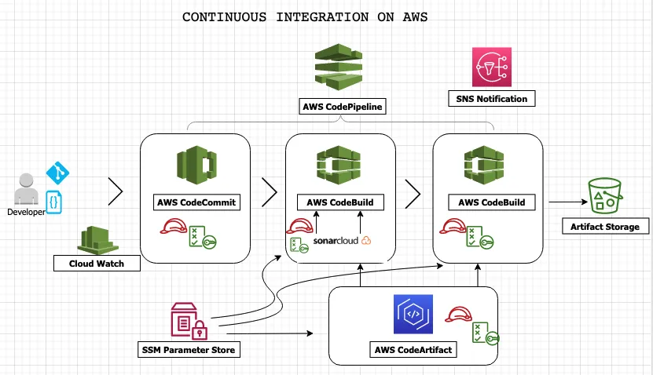
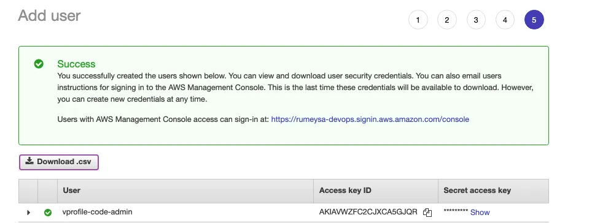
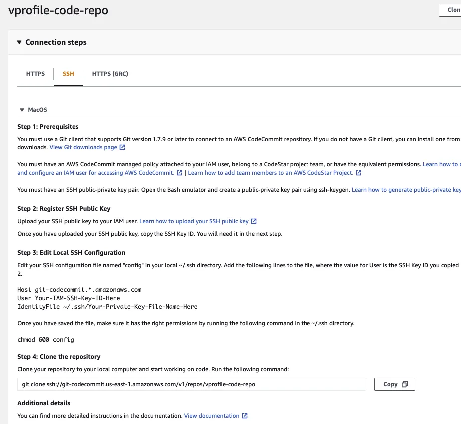
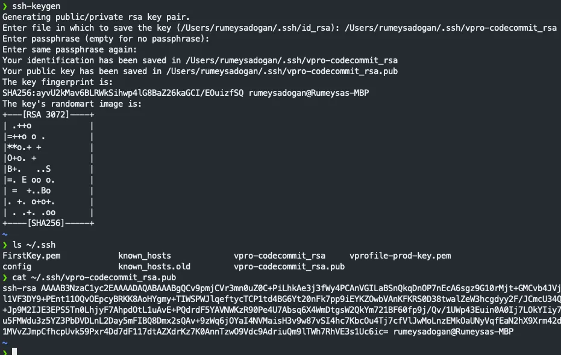
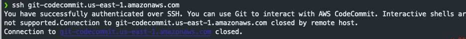

# Continuous Delivery on AWS

Continous Delivery on AWS.

## 🚀 Project Overview

The project involves a continuous integration and deployment (CI/CD) pipeline for software development on AWS. Here's an overview of the process:

- **Code Commit**: Developers regularly commit code changes, which trigger the CI/CD pipeline.

- **CodeBuild Trigger**: Commits trigger AWS CodeBuild, which initiates the build process.

- **Code Analysis**: CodeBuild performs code analysis using Sonarcloud. SonarCloud (same as SonarQube) is a cloud-based code quality and security service provided by SonarSource. It integrates with Git repositories to analyze code for bugs, vulnerabilities, code smells, and other issues.

- **Dependency Management**: Dependencies required for the project are downloaded from AWS CodeArtifact, ensuring consistency and reliability.

- **Artifact Building**: CodeBuild utilizes Maven to build the artifact from the source code.

- **Artifact Storage**: The built artifact is stored in an S3 bucket for future deployment.

- **Deployment**: AWS Deploy deploys the artifact to an Elastic Beanstalk environment, ensuring scalability and ease of management.

- **Database Connection**: The Beanstalk environment is connected to an RDS (Relational Database Service) instance for data storage and retrieval.

- **Software Testing**: After deployment, software testing is executed using AWS CodeBuild services to verify the functionality and stability of the deployed application.

This CI/CD pipeline automates the software development process, from code commits to deployment, ensuring efficient and reliable delivery of software updates.

## 🔧 Problem Statement
In the context of software development on AWS, there exists a need to establish a robust and efficient continuous integration and deployment (CI/CD) pipeline. The current manual processes for code commits, code analysis, artifact building, and deployment are prone to errors, inconsistencies, and inefficiencies. To address these challenges, the objective is to design and implement an automated CI/CD pipeline that seamlessly integrates with AWS services. This pipeline should enable developers to commit code changes confidently, knowing that they will undergo thorough code analysis, dependency management, artifact building, and deployment processes. Additionally, the pipeline should facilitate seamless database connection, software testing, and scalability of deployed applications. The ultimate goal is to streamline the software development lifecycle, ensuring consistent, reliable, and timely delivery of software updates while minimizing manual intervention and maximizing resource utilization.

## 💽 Techonology Stack
● **Application Integration:** Simple Notification Service (SNS)

● **Management & Governance:** CloudWatch.

● **Security, Identity & Compliance:** Secret Manager, SonarCloud(SonarQube)

● **CI/CD:** Automate deployment using AWS Code Pipeline, AWS CodeBuild, AWS CodeCommit, AWS CodeArtifact

## 📌 Architecture Diagram



## 🚦 Getting Started

### Prerequisites

Before you get started, make sure you have the following prerequisites in place:

- AWS account.
- AWS CLI.
- SonarCloud account.
- Git for cloning the repository.

## 📋 Table of Contents

- [Step-1: Setup AWS CodeCommit](#-Setup-AWS-CodeCommit)
- [Step-2: Setup AWS CodeArtifact](#-Setup-AWS-CodeArtifact)
- [Step-3: Setup SonarCloud](#-Setup-SonarCloud)
- [Database Tier](#-database-tier)
- [Terraform Configuration](#-terraform-configuration)
- [Deployment](#-deployment)
- [Usage](#-usage)
- [Contributing](#-contributing)
- [License](#-license)

## ✨ Setup-AWS-CodeCommit


- Go to AWS Console, and pick us-east-1 region then go to CodeCommit service. Create repository.

   ```bash
   Name: vprofile-code-repo
   ```

- Next, create an IAM user with CodeCommit access from IAM console. We will create a policy for CodeCommit and allow full access only for vprofile-code-repo.

   ```bash
   Name: vprofile-code-admin-repo-fullaccess
   ```



- To be able connect our repo, follow steps given in CodeCommit.




- Create SSH key in local server and add public key to IAM role Security credentials.




- Update configuration under .ssh/config and add our Host information. And change permissions with chmod 600 config

   ```bash
   Host git-codecommit.us-east-1.amazonaws.com
       User <SSH_Key_ID_from IAM_user>
       IdentityFile ~/.ssh/vpro-codecommit_rsa
   ```

- We can test our ssh connection to CodeCommit.

   ```bash
   ssh git-codecommit.us-east-1.amazonaws.com
   ```


- Next, clone the repository to a location of your choice in your local server.

- Convert the Github repository for vprofile-project in your local server, to your CodeCommit repository. In Github repo directory.

- Run the command below.

   ```bash
    git checkout master
    git branch -a | grep -v HEAD | cur -d'/' -f3 | grep -v master > /tmp/branches
    for i in `cat  /tmp/branches`; do git checkout $i; done
    git fetch --tags
    git remote rm origin
    git remote add origin ssh://git-codecommit.us-east-1.amazonaws.com/v1/repos/vprofile-code-repo
    cat .git/config
    git push origin --all
    git push --tags
   ```

- Our repo is ready on CodeCommit with all branches.


## 🌟 Setup-AWS-CodeArtifact

- Create CodeArtifact repository for Maven:

   ```bash
    Name: vprofile-maven-repo
    Public upstraem Repo: maven-central-store
    This AWS account
    Domain name: visualpath
   ```  

- Follow connection instructions given in CodeArtifact for maven-central-repo.


- Create an IAM user for CodeArtifact and configure aws CLI with its credentials. We will give Programmatic access to this user to enable use of aws cli and download credentials file.

   ```bash
    aws configure # provide iam user credentials
   ```  


- Run command get token as in the instructions.

   ```bash
    export CODEARTIFACT_AUTH_TOKEN=`aws codeartifact get-authorization-token --domain visualpath --domain-owner 392530415763 --region us-east-1 --query authorizationToken --output text`
   ```  
- Update pom.xml and setting.xml file with correct urls as suggested in instruction then push files to codeCommit.

   ```bash
    git add .
    git commit -m "message"
    git push origin ci-aws
   ```  
## 🚀 Setup-SonarCloud

The Application Tier hosts the application servers responsible for running business logic and interacting with the database tier. Key components include:

- **Application Servers**: These run your application code and can be horizontally scaled.
- **Load Balancer**: Distributes traffic to the application servers.
- **Auto Scaling**: Automatically adjusts the number of web servers based on traffic.
- **Security Groups**: Controls incoming and outgoing traffic to the application servers.

### Application Tier Configuration

- [Launch Template Configuration](launch-template-app.tf)
- [Load Balancer Configuration](alb-app.tf)
- [Auto Scaling Configuration](asg-app.tf)
- [Security Group Configuration of Load balancer](alb-app-sg.tf)
- [Security Group Configuration of Auto Scaling Group](asg-app-sg.tf)

## 💽 Database Tier

The Database Tier stores and manages our application data. We use Amazon RDS for a managed database service. Key components include:

- **Amazon RDS**: A managed database service for MySQL/PostgreSQL/SQL Server databases.
- **Security Groups**: Control incoming and outgoing traffic to the database.

### Database Tier Configuration

- [DB Subnet group Configuration](db-subnet-group.tf)
- [Amazon RDS Configuration](rds.tf)
- [Security Group Configuration](db-sg.tf)

## 🔧 Terraform Configuration

The Terraform configuration for this project is organized into different and resources to create the necessary AWS infrastructure components. Key resources include:

- Virtual Private Cloud (VPC)
- Subnets and Route Tables
- Security Groups and Network ACLs
- Load Balancers
- Auto Scaling Groups
- RDS Database Instances

## 🚀 Deployment

Follow these steps to deploy the architecture:

1. Clone the repository:

   ```bash
   git clone https://github.com/mathesh-me/multi-tier-architecture-using-terraform.git
   ```

2. Make changes as per your needs.
3. Initialize Terraform and apply the configuration:
   ```
   terraform init
   ```
4. Review the changes and confirm.

## 💼 Usage

### Scaling
- To scale the Web or Application Tier, use Auto Scaling configurations provided in the respective Terraform files. Adjust the desired capacity to match your scaling requirements.
### Database Management
- Access the Amazon RDS instance in the Database Tier to manage your data.
### Load Balancing
- Configure the load balancer in the Web and Application Tiers to distribute traffic evenly.
### Security Considerations
- Review and customize the security groups and network ACLs to meet your specific security requirements.

## 🤝 Contributing
Contributions are Welcome! Please read my Contributing Guidelines to get started with contributing to this project.

## 📄 License
This project is licensed under the MIT License.
