# Hosting a Static Website Using Amazon S3
Automate the Process of Hosting a Static Website Using Amazon S3 and AWS Developer Tools.

## 🚀 Project Overview
For this project we will have a static website hosted on S3 and will be utilizing CodePipeline to monitor and automatically deploy changes made from our CodeCommit repository where our index.html is hosted. Then we’ll setup CloudFront as a CDN that will redirect HTTP requests to HTTPS.

## 🔧 Problem Statement
Inefficient manual deployment processes and lack of content delivery network (CDN) optimization hinder the seamless deployment and accessibility of a static website hosted on Amazon S3. Additionally, the absence of automated monitoring and deployment mechanisms further complicates the update process, leading to delays and potential inconsistencies in website content. To address these challenges, our project aims to automate the deployment process using AWS services such as CodePipeline and CodeCommit, while also enhancing website performance and security by implementing CloudFront as a CDN to redirect HTTP requests to HTTPS.

## 💽 Techonology Stack
● **CDN:** AWS Cloudfront

● **Storage:** AWS S3 for file storage.

● **CI/CD:** Automate deployment using AWS Code Pipeline, AWS CodeBuild

## 📌 Architecture Diagram

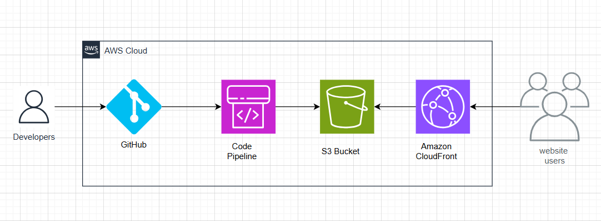

## 🌟 Project Requirements

Your team has asked you to create a way to automate the deployment of a website. Currently your developers have to go through the process manually to test each new update to their code. You’ll need to provide the static site URL to the developers and also make a modification to the code in the GitHub repo to verify the pipeline is working.

`https://github.com/cloudspaceacademy/aws-static-web-hosting.git`

1. Create a new repository in GitHub and load the attached HTML.
2. Create and configure a S3 bucket to host your static website.
3. Create a CI/CD pipeline using the **AWS Codepipeline service **.
4. Set your repo as the Source Stage of the Codepipeline that is triggered when an update is made to a GitHub repo.
5. For the deploy stage select your S3 bucket.
6. Deploy the pipeline and verify that you can reach the static website.
7. Make an update to the code in your github to verify that the codepipeline is triggered. This can be as simple as a change to the Readme file because any change to the files should trigger the workflow.

Note: you can skip the Build stage for this project.

Your app is very popular all around the world but some users are complaining about slow load times in some Regions. You have been asked to add CloudFront as a CDN for your static website. CloudFront should allow caching of your static webpage and only allow HTTPS traffic to your site.

## 📋 Table of Contents

- [Step-1: Setup S3 Bucket](#Step-1-Setup-S3-Bucket)
- [Step-2: Setup Pipeline](#Step-2-Setup-Pipeline)
- [Step-3: Test The Pipeline](#Step-3-Test-The-Pipeline)
- [Step-4: Setting Up Cloudfront](#Step-4-Setting-Up-CloudFront)
- [Step-5: Testing Up Cloudfront](#Step-5-Testing-Up-Cloudfront)

## 🚀 Instructions

Create New Repository and Clone it.

First we need to create a repository.

Navigate to `GitHub -> Repositories -> Create Repository` and give it a name.

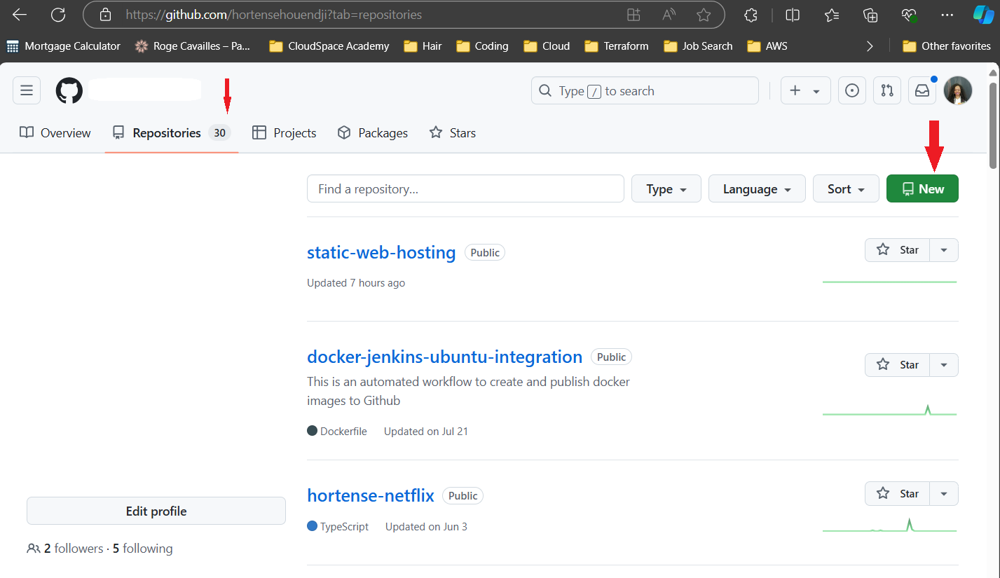

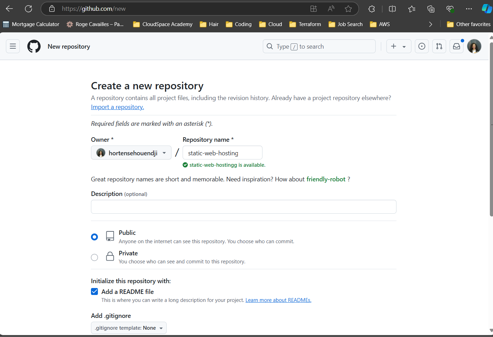

Use the Clone URL to clone it to your local system.

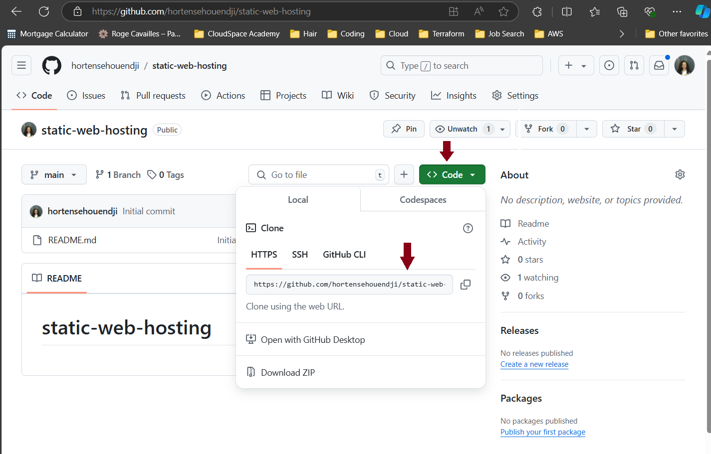

Add your files to your local repository, commit your changes, and push your changes.

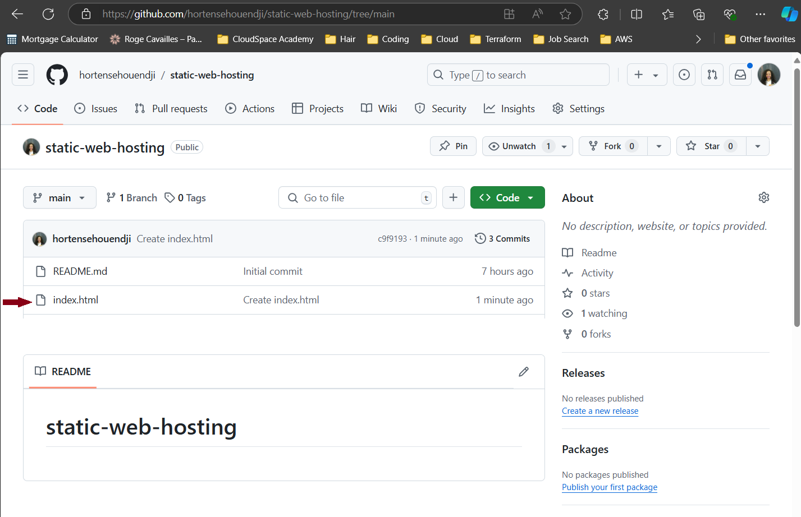

File has been pushed from our local repo to Github.

### ✨ Step-1-Setup-S3-Bucket

**Create S3 Bucket**

`Navigate to S3 -> Create Bucket.`

Uncheck **Block all Public Access** and acknowledge.

`Navigate to your bucket -> Properties -> Edit Static website hosting`

Enable Static website hosting and add your index document

Now we need to create a bucket policy. Got to Permissions and edit the bucket policy.

The following will allow everyone to access the bucket using the GetObject command,

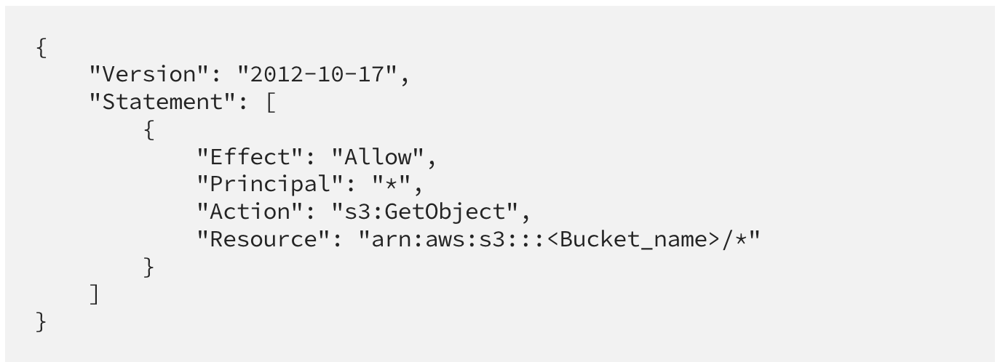

### ✨ Step-2-Setup-Pipeline

**Setup Pipeline**

`Navigate to CodePipeline -> Create pipeline provide a name and click next.`

Source Provider = **GitHub (Version 2)**

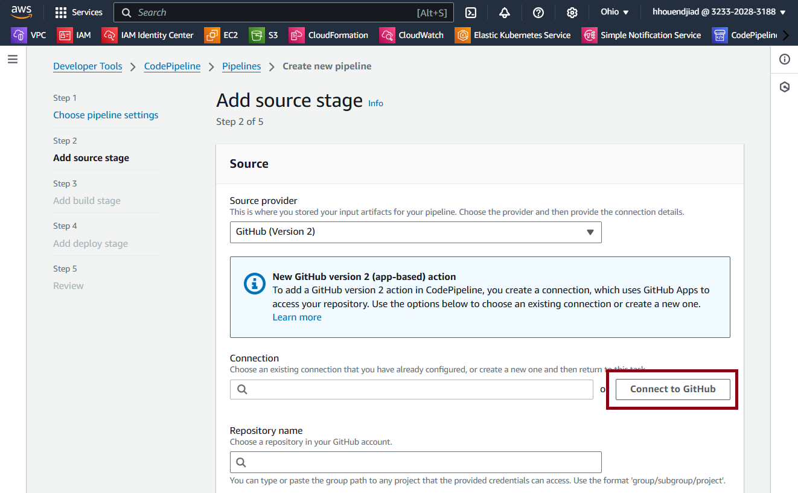

Click on `Connect to GitHub`

Now, let's connect the pipeline to our GitHub repository

On `Create a connection` give a name to the connection. Next, click on `Connect to GitHub`, Then `Connect` 

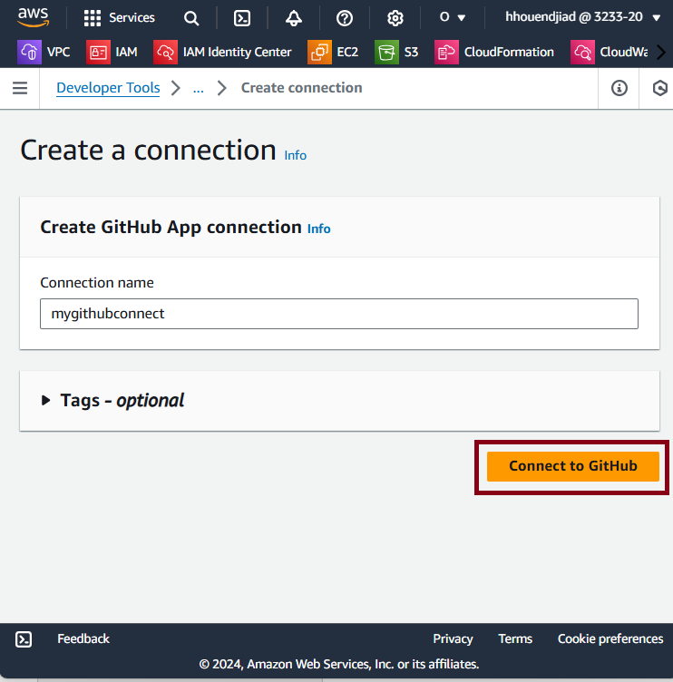

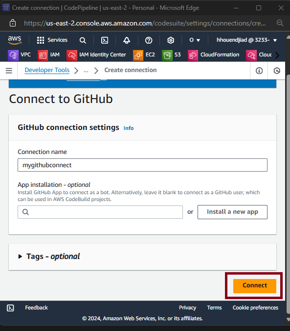

At this point, the pipeline and the Github repository are connected

Repository name = **Select your repo from the list**

Branch Name = **main**

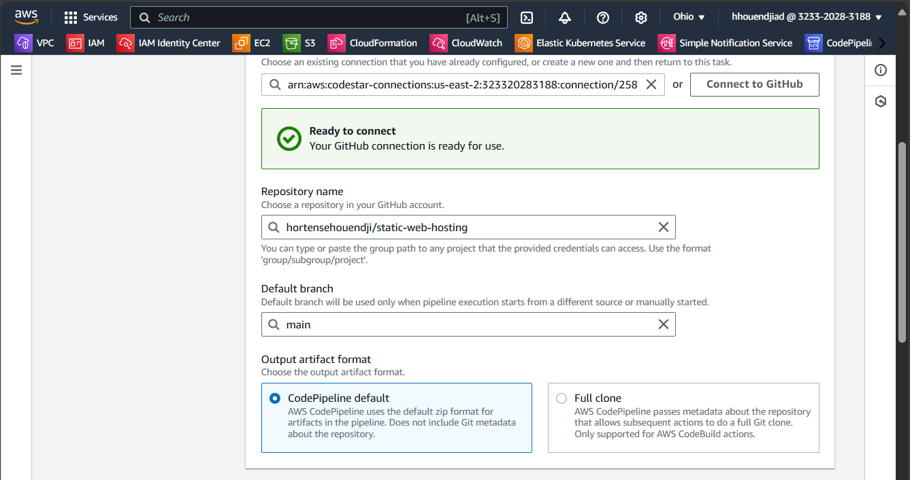

Everything else is default, click on `Next`

Skip the build stage.

You’ll want to use the following:

Deploy Provider: **Amazon S3**

Region: **US East**

Bucket: **<Bucket Name>**

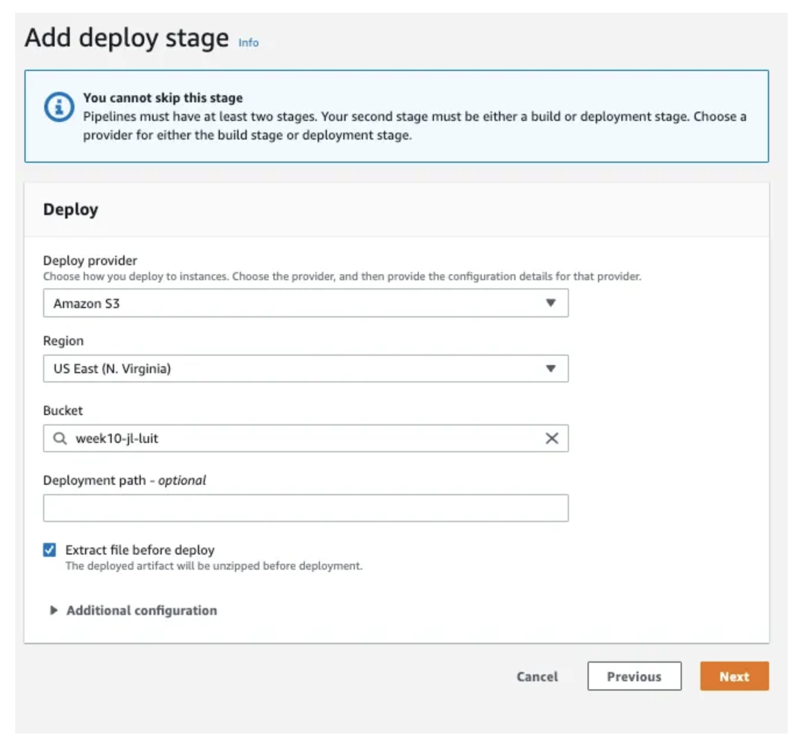

We can see that it is succeeded.

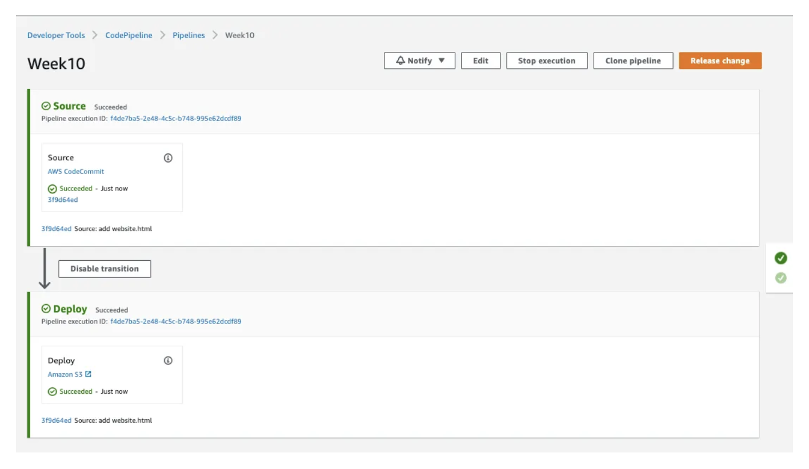

Let’s test if it works by going checking our bucket website endpoint. You can find this under properties of your bucket in the static website hosting section.

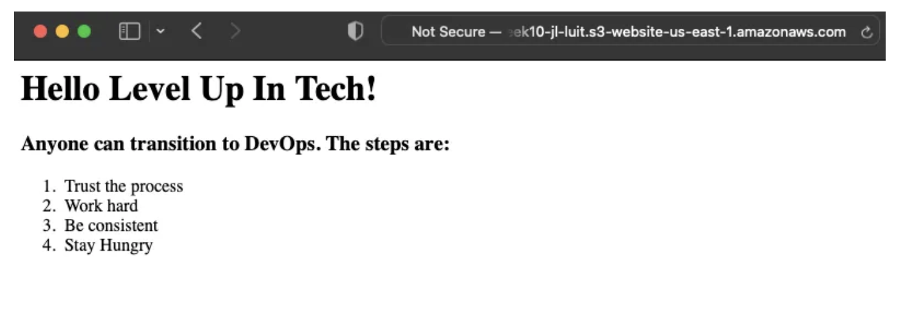

### ✨ Step-3-Test-The-Pipeline

**Test the Pipeline**

We will be testing the pipeline by modifying the file locally, pushing the file to GitHub. CodePipeline should see this change and deploy our new file with our changes to the website.

Update the background color by adding this line of code to your html file and commit the changes and push it to GitHub:
``` <body style="background-color:MediumSeaGreen;"></body> 
```

We can see that CodePipeline saw the change and pushed our new changes.

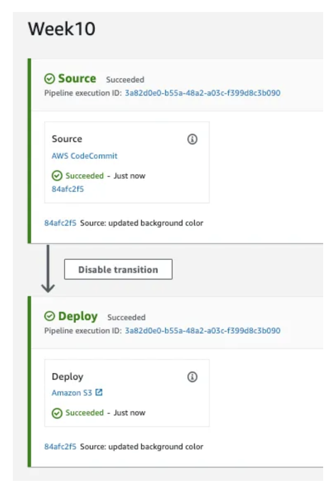

I checked my endpoint and see that the changes have applied.

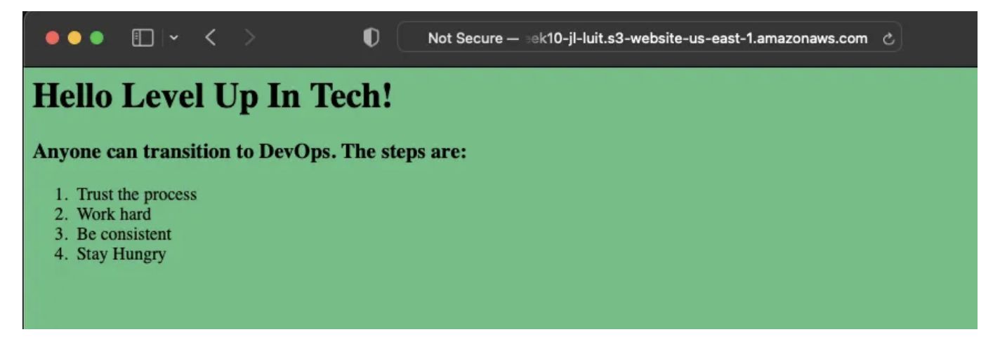

### ✨ Step-4-Setting-Up-CloudFront

**Setting up CloudFront**

First go to the CloudFront in the AWS Console and click on Create Distribution.

Start typing your bucket name and it’ll auto-populate.

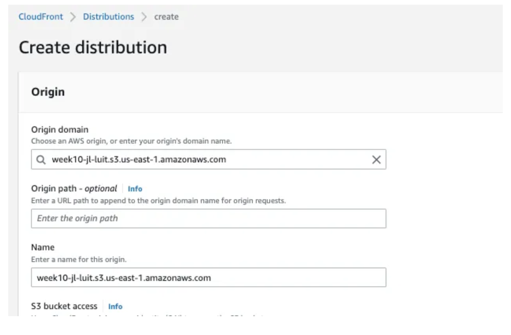

Scroll down a little bit and change the view to Redirect HTTP to HTTPS and then create distribution.

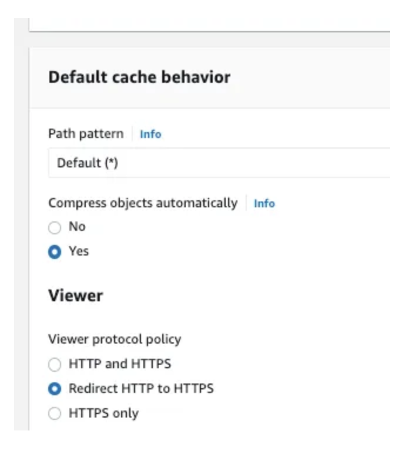

This should send any **HTTP** request to **HTTPS**.

Wait about 10 mins for the status to change from Deploying to Enabled.

Click on your distribution and copy the Distribution domain name.

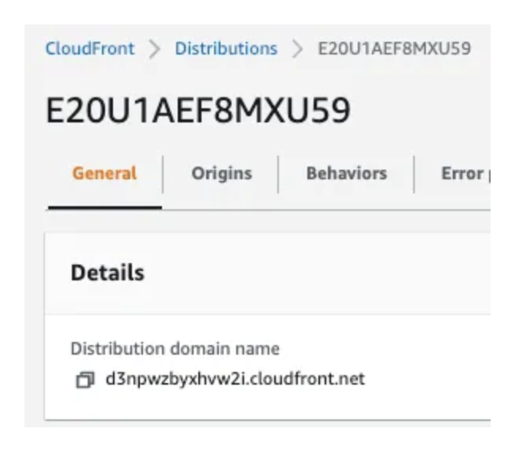

Paste it into your browser but don’t hit enter yet. The copied link will run as paste in HTTPS. Since we want to make sure that the redirect we set works. We’re going to put http in the front and append our index.html file to the end.

### ✨ Step-5-Testing-Up-Cloudfront

**Testing up CloudFront**

`http://d3npwzbyxhvw2i.cloudfront.net/index.html`

Now that we enter, we can see the request was redirected to HTTPS.


We have successfully created a repository, a static website and used CodePipeline to automatically deploy our changes. Then we setup CloudFront for our static website.

## 📄 License

This project is licensed under the **MIT License.**
