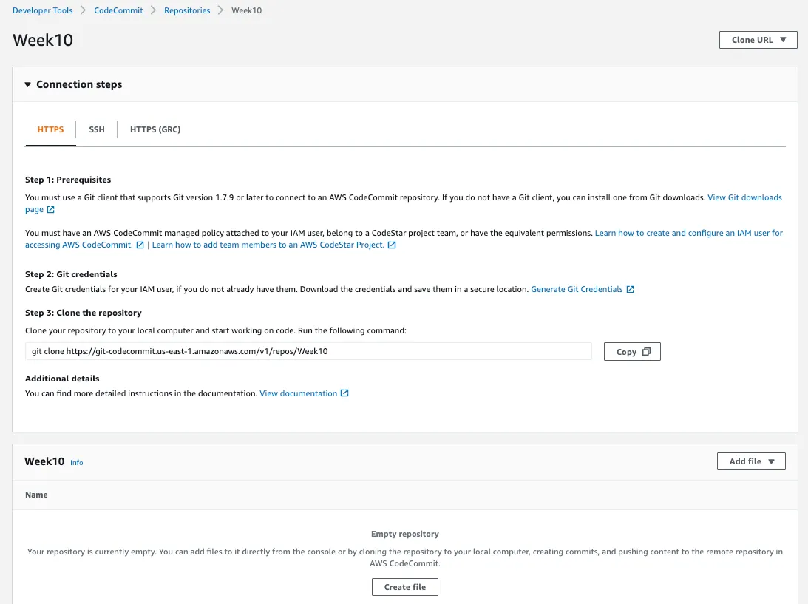
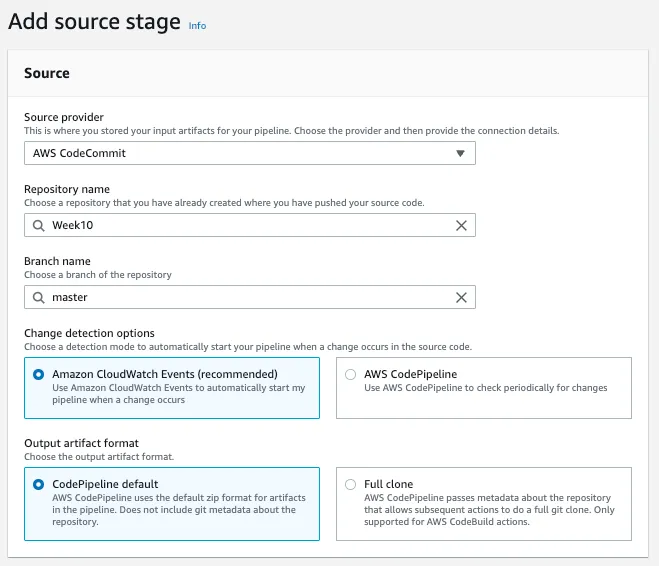

### Uh oh :(

# https://github.com/cloudspaceacademy/aws-static-web-hosting.git

# Overview:
For this project we will have a static website hosted on S3 and will be utilizing CodePipeline to monitor and automatically deploy changes made from our CodeCommit repository where our index.html is hosted. Then we’ll setup CloudFront as a CDN that will redirect HTTP requests to HTTPS.

# Problem Statement

# Techonology Stack

# Architecture Diagram

# Project Requirements:

Your team has asked you to create a way to automate the deployment of a website. Currently your developers have to go through the process manually to test each new update to their code. You’ll need to provide the static site URL to the developers and also make a modification to the code in the GitHub repo to verify the pipeline is working.

1. Create a new repository in GitHub or CodeCommit and load the attached HTML.
2. Create and configure a S3 bucket to host your static website.
3. Create a CI/CD pipeline using the **AWS Codepipeline service **.
4. Set your repo as the Source Stage of the Codepipeline that is triggered when an update is made to a GitHub repo.
5. For the deploy stage select your S3 bucket.
6. Deploy the pipeline and verify that you can reach the static website.
7. Make an update to the code in your github to verify that the codepipeline is triggered. This can be as simple as a change to the Readme file because any change to the files should trigger the workflow.

Note: you can skip the Build stage for this project.

Your app is very popular all around the world but some users are complaining about slow load times in some Regions. You have been asked to add CloudFront as a CDN for your static website. CloudFront should allow caching of your static webpage and only allow HTTPS traffic to your site.

# Instructions

Create New Repository and Clone it.

First we need to create a repository.

Navigate to GitHub -> Repositories -> Create Repository and give it a name.

Use the Clone URL to clone it to your local system.

Add your files to your local repository, commit your changes, and push your changes.

File has been pushed from our local repo to CodeCommit.

Create S3 Bucket

Navigate to S3 -> Create Bucket.

Uncheck “Block all Public Access” and acknowledge.

Navigate to your bucket -> Properties -> Edit Static website hosting

Enable Static website hosting and add your index document

Now we need to create a bucket policy. Got to Permissions and edit the bucket policy.

The following will allow everyone to access the bucket using the GetObject command,

Setup Pipeline.

Navigate to CodePipeline -> Create pipeline provide a name and click next.

Source Provider = AWS CodeCommit

Repository name = “Select your repo from the list”

Branch Name = **Master**

