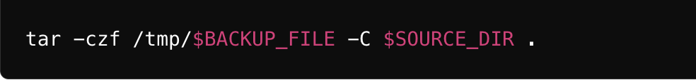

# Bash Scripting Party


## 🚀 Project Overview
This project involves creating a bash script that takes the backup of a local folder and sends it to an Amazon S3 bucket every hour. The project aims to teach students the basics of scripting, automation, and using AWS S3 for storage.

## 🔧 Problem Statement
The task is to develop a solution that ensures a local directory's contents are backed up to Amazon S3 automatically and regularly. This will help in ensuring data durability and accessibility from anywhere. The solution should be simple, efficient, and require minimal manual intervention.

## 💽 Techonology Stack
● **Bash**: For scripting

● **AWS CLI**: For interacting with Amazon S3

● **Cron**: For scheduling the script to run every hour


## 📌 Architecture Diagram


## 🚦 Getting Started

### 🌟 Prerequisites

Before diving into the project, let’s ensure that we have the necessary prerequisites.

- AWS account.
- AWS CLI.
- Local computer (MacOs or Ubuntu or Windows).
- Bash.

## 📋 Table of Contents

- [Step-1: Setup AWS S3 Bucket](#-Step-1-Setup-S3-Bucket)
- [Step-2: Install and Configure AWS CLI](#-Step-2-Install-and-Configure-AWS-CLI)
- [Step-3: Create Backup Script](#-Step-3-Create-Backup-Script)
- [Step-4: Schedule Script with Cron](#-Step-4-Schedule-Script-with-Cron)
- [Step-5: Testing](#-Step-5-Testing)

## ✨ Step-1-Setup-S3-Bucket
    
- Log in to the AWS Management Console.
- Navigate to S3 Service.
- Create a new bucket with a unique name (e.g., my-backup-bucket).
    


## ✨ Step-2-Install-and-Configure-AWS-CLI

* For macOS

  A. Install AWS CLI

Using Homebrew (recommended):

```bash

    brew install awscli

```

Alternatively, using the bundled installer:

```bash

    curl "https://awscli.amazonaws.com/AWSCLIV2.pkg" -o "AWSCLIV2.pkg"
    sudo installer -pkg AWSCLIV2.pkg -target /


```

  B. Configure AWS CLI

```bash

    aws configure

```

Provide your AWS Access Key, Secret Key, region, and output format.


* For Ubuntu

  A. Install AWS CLI

Using the package manager:

```bash

    sudo apt-get update
    sudo apt-get install awscli -y


```

Alternatively, using the bundled installer:

```bash

    curl "https://awscli.amazonaws.com/awscli-exe-linux-x86_64.zip" -o "awscliv2.zip"
    unzip awscliv2.zip
    sudo ./aws/install

```

  B. Configure AWS CLI

```bash

    aws configure

```

Provide your AWS Access Key, Secret Key, region, and output format.


* For Windows

  A. Install AWS CLI

Download the AWS CLI MSI installer from the [official website](https://docs.aws.amazon.com/cli/v1/userguide/install-windows.html).

Run the downloaded MSI installer and follow the instructions to complete the installation.

  B. Configure AWS CLI

Open Command Prompt or PowerShell.

```bash

    aws configure

```

Provide your AWS Access Key, Secret Key, region, and output format.

## ✨ Step-3-Create-Backup-Script

    Create a bash script named 'backup_to_s3.sh:'

```bash

    #!/bin/bash

    # Variables
    SOURCE_DIR="/path/to/local/folder"
    BUCKET_NAME="my-backup-bucket"
    DATE=$(date +%Y-%m-%d-%H-%M-%S)
    BACKUP_FILE="backup-$DATE.tar.gz"

    # Create a compressed archive of the source directory
    tar -czf /tmp/$BACKUP_FILE -C $SOURCE_DIR .

    # Upload the backup file to S3
    aws s3 cp /tmp/$BACKUP_FILE s3://$BUCKET_NAME/

    # Remove the local backup file
    rm /tmp/$BACKUP_FILE


```


Make the script executable:

```bash

    chmod +x backup_to_s3.sh

```

Explanation of Commands:

A. Define Variables


● **SOURCE_DIR**: Path to the local directory you want to back up.

● **BUCKET_NAME**: Name of your S3 bucket.

● **DATE**: Current date and time in YYYY-MM-DD-HH-MM-SS format to create unique backup filenames.

● **BACKUP_FILE**: Name of the backup file that includes the date and time.


B. Create a Compressed Archive of the Source Directory



● **tar**: Command to create an archive.

● **-czf**: Options to create a compressed (-c), gzip (-z) file with the name specified (-f).

● **/tmp/$BACKUP_FILE**: : Path and name of the output file.

● **-C $SOURCE_DIR .**: Change to the source directory and include all its contents in the archive.

C. Upload the Backup File to S3


● **aws s3 cp**: AWS CLI command to copy files to S3.

● **/tmp/$BACKUP_FILE**: Path to the local backup file.

● **s3://$BUCKET_NAME/**: Destination S3 bucket.


D. Remove the Local Backup File


● **rm**: Command to remove/delete files.

● **/tmp/$BACKUP_FILE**: Path to the local backup file to be deleted after upload.


## ✨ Step-4-Schedule-Script-with-Cron

Cron is a time-based job scheduler in Unix-like operating systems. It allows users to schedule jobs (commands or scripts) to run automatically at specified intervals or times. Cron is widely used for automating system maintenance and administration tasks, such as backups, updates, and periodic monitoring.

1. Open the cron file
    In the pipeline script, add the following code to clone the code from your repository:
    
    ```bash

        crontab -e

    ```

2. Add the following line to schedule the script to run every hour:

    ```bash
        0 * * * * /path/to/backup_to_s3.sh >> /var/log/backup_to_s3.log 2>&1
    ```

● **0 * * * ***: Schedule to run at the start of every hour.

● **/path/to/backup_to_s3.sh**: Path to the backup script.

● **>> /var/log/backup_to_s3.log 2>&1**:  Redirect stdout and stderr to a log file for debugging and monitoring.

## ✨ Step-5-Testing


- Manually run the script to ensure it works:

    ```bash
        ./backup_to_s3.sh
    ```

- Check the S3 bucket to confirm the backup file is uploaded.


- Monitor the log file /var/log/backup_to_s3.log for any errors or confirmations that the script runs every hour.


