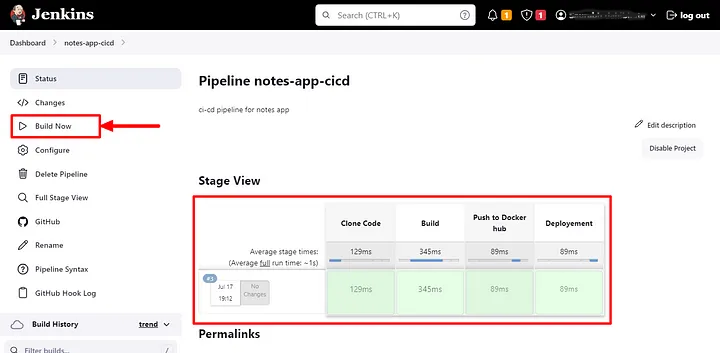
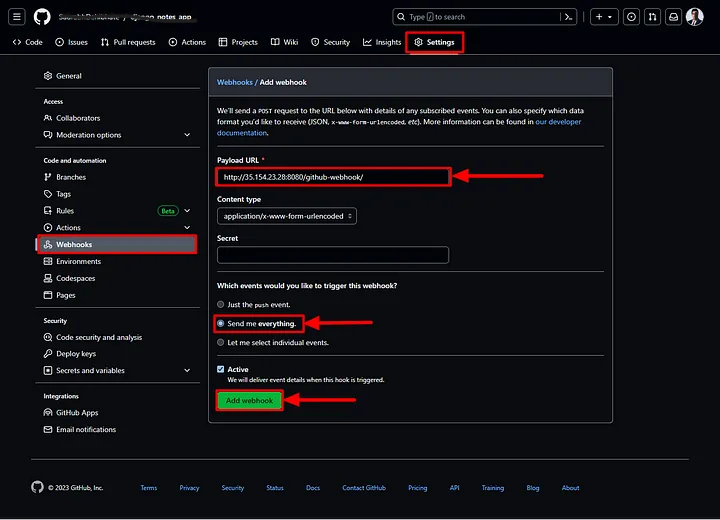
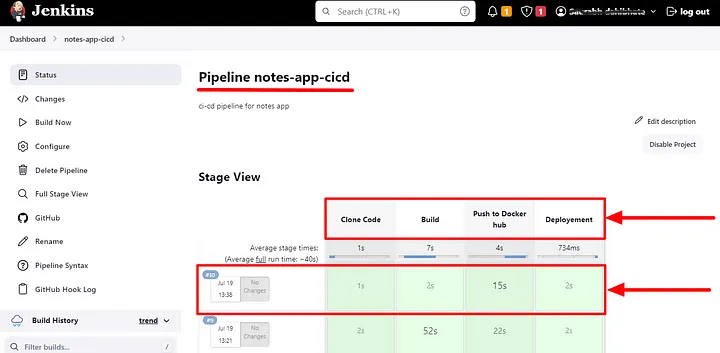
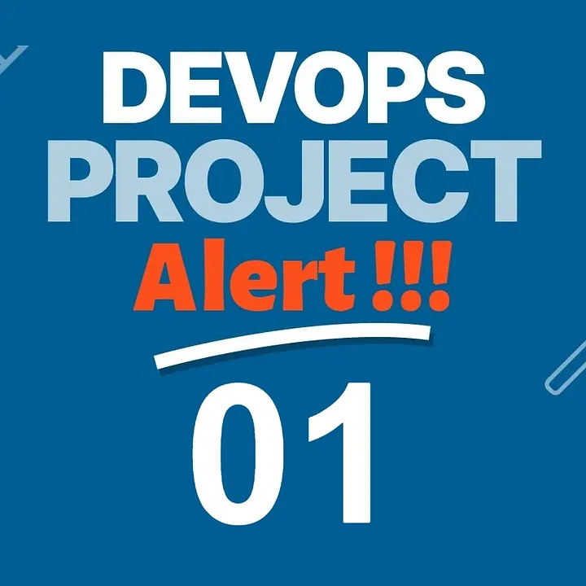

# containerized deployment
Automate the Process of deloying a containerized application

## 🚀 Project Overview
In this project, we will explore a DevOps project that involves deploying a Django notes app on an EC2 instance using Jenkins declarative CI/CD pipeline. We will leverage Docker containers and Docker Hub for containerization and image management. The project focuses on automating the deployment process, ensuring seamless integration and delivery of the application.

## 🔧 Problem Statement
The goal of this project is to develop a robust and automated deployment solution for containerized applications, leveraging Jenkins as the orchestration engine and Docker for containerization. By automating the deployment process, we aim to enhance efficiency, reduce manual intervention, and establish a continuous deployment pipeline that ensures rapid, consistent, and reliable delivery of containerized applications.

## 💽 Techonology Stack
● **Server**: EC2

● **Containerization Platform**: Docker

● **CI/CD**: Automate deployment using Jenkins

● **Version Control**: Automate deployment using Jenkins


## 📌 Architecture Diagram


## 🚦 Getting Started

### 🌟 Prerequisites

Before diving into the project, let’s ensure that we have the necessary prerequisites.

- AWS account.
- AWS CLI.
- Dockerhub account.
- Git for cloning the repository.

## 📋 Table of Contents

- [Step-1: Setup EC2 instance](#-Step-1-Setup-EC2-instance)
- [Step-2: Setup Jenkins](#-Step-2-Setup-Jenkins)
- [Step-3: Setup Jenkins pipeline](#-Step-3-Setup-Jenkins-Pipeline)
- [Step-4: Push Docker container to Dockerhub](#-Step-4-push-Docker-container-to-Dockerhub)

## ✨ Step-1-Setup-EC2-instance

- First of all, go to the AWS portal, and create a new instance.
    Example: 
        · Name: jenkins-server
        · AMI: ubuntu.
        · Instance type: t2.micro (free tier).
        · Key pair login: Create > docker.pem.
        · Allow HTTP.
        · Allow HTTPS.
        (Download the .pem file.)

    Click on Launch Instance, then connect to the EC2 instance and install following packages

- [Install Docker](https://docs.docker.com/engine/install/)

- Install Java
    
    Install Openjdk-17-jre- by running the following command: `sudo apt install openjdk-17-jre`

- [Install Jenkins](https://www.jenkins.io/doc/book/installing/)

- Install Docker compose 
    
    run the following command: `sudo apt-get install docker-compose`

Make sure you have this Installed on your system.

Additionally, we need to add users to the Docker group to grant them appropriate permissions. Run the following commands to add users to the Docker group:

>   sudo usermod -aG docker $USER
>   sudo usermod -aG docker jenkins
>   sudo reboot

Remember to reboot the system after making these changes.


## ✨ Step-2-Setup-Jenkins

* Now, we will allow “Inbound Rule” ports 8080 and 8000 for this machine from a security group. We can find the security group in the ec2 instance description.

* Now, Copy the Public Ip of the machine and paste it to the browser to access the Jenkins portal.

* We need an Administrator Password to unlock this. Run following command

* `cat /var/lib/jenkins/secrets/initialAdminPassord`

* Now Click on, “Install Suggested Plugins”

* Now, Jenkins will ask us to create the First Admin User.

* You can get Jenkins homepage.

## ✨ Step-3-Setup-Jenkins-Pipeline

After configuring Jenkins, lets create a CI/CD pipeline to understand the stages.

* From Jenkins Dashboard, Click on “New Item”.


* Now, Add the name as
    Name: notes-app-cicd
    Project: Pipeline
    Click “Ok”.

Now we have to configure pipeline as follows
    
Dashboards > notes-app-cicd > configuration > general

Check✅Github project

[project url](https://github.com/cloudspaceacademy/containerization-deployment.git)


Check ✅GitHub hook trigger for GITScm polling

Put this basic Declarative pipeline code in script dialog box

```bash

    pipeline {
        agent any

        stages {
           stage('Clone Code') {
                steps {
                    echo 'Cloning the code'
                }
            }
            stage('Build') {
                steps {
                    echo 'This is Build Stage'
                }
            }
            stage('Push to Docker hub') {
                steps {
                    echo 'This is Test stage'
                }
            }
            stage('Deployement') {
                steps {
                    echo 'Deploying container'
                }
            }
        }
    }

```

This code represents a Jenkins declarative pipeline, which is a popular way to define continuous integration and continuous deployment (CI/CD) workflows. Let’s go through each section and understand its purpose:

- `**agent any**` : This line specifies that the pipeline can run on any available agent or executor in the Jenkins environment.

- `**stages**`: This block defines the different stages of the pipeline. Each stage represents a logical step in the CI/CD process.

- `**stage('Clone Code')**`: This stage is responsible for cloning the source code repository. In this case, the pipeline simply echoes the message "Cloning the code." In a real scenario, this stage would typically include commands to clone the repository using a version control system like Git.

-  `**stage('Build')**`: This stage is responsible for building the application or project. Here, the pipeline echoes the message "This is the Build Stage." In a real scenario, this stage would typically include commands to compile the code, run tests, and generate build artifacts.

-  `**stage('Push to Docker hub')**`: This stage is responsible for pushing the built artifacts to a Docker registry (such as Docker Hub). The pipeline echoes the message "This is the Test stage." In a real scenario, this stage would typically include commands to package the application into a Docker container and push it to the desired registry.

- `**stage('Deployment')**`: This stage is responsible for deploying the application or container to the target environment. The pipeline echoes the message "Deploying container." In a real scenario, this stage would typically include commands to deploy the Docker container or perform any necessary configuration and setup for the application to run.

Each stage can have more complex logic and multiple steps, such as running shell commands, executing scripts, or invoking external tools.

By defining the pipeline stages and their associated steps, Jenkins can automate the entire CI/CD process, providing a consistent and reproducible workflow for building, testing, and deploying software applications.


* Now Click on Save button and start the build on pipeline page



* After getting success, you can see stages are green boxes with execution time.

## ✨ Step-4-push-Docker-container-to-Dockerhub

1. Clone the code
    In the pipeline script, add the following code to clone the code from your repository:
    
    ```bash

        git url: "https://github.com/cloudspaceacademy/containerization-deployment.git", branch: "main"

    ```

2. Build the code
    Add the following code to build the application and create docker image with tag

    ```bash
        sh "docker build -t notes-app ."
    ```

3. Push to Docker Hub
    Add the code to push the Docker image to Docker Hub:

    For docker login in pipeline you have to create docker credentials and use them as environment variable

    Create Credentials in Dashboard > Manage jenkins > Credentials > System > Global credentials


```bash
    withCredentials([usernamePassword(credentialsId:"dockerhub-login",passwordVariable:"dockerhubpass",usernameVariable:"dockerhubuser" )]){
    sh "docker tag notes-app ${env.dockerhubuser}/notes-app:latest"
    sh "docker login -u ${env.dockerhubuser} -p ${env.dockerhubpass}" 
    sh "docker push ${env.dockerhubuser}/notes-app:latest"
   }
```

- `**withCredentials**`: This is a Jenkins pipeline step provided by the "Credentials Binding Plugin." It allows you to securely retrieve and use credentials within the block. In this case, we are retrieving the Docker Hub credentials using the `usernamePassword` method.

- `**usernamePassword(credentialsId: "dockerhub-login", passwordVariable: "dockerhubpass", usernameVariable: "dockerhubuser")**`: This line retrieves the username and password from the Jenkins credentials store. The credentialsId parameter specifies the unique identifier of the stored Docker Hub credentials. The usernameVariable and passwordVariable parameters define the environment variables where the username and password will be stored, respectively. The environment variables are prefixed with env. in Jenkins, which is why you see env.dockerhubuser and env.dockerhubpass later in the code.

- `**sh "docker tag notes-app ${env.dockerhubuser}/notes-app:latest"**`: This line creates a new Docker image tag with the Docker Hub username as a prefix. The `notes-app` is the original local image name, and we're tagging it with the new name `${env.dockerhubuser}/notes-app:latest`. This is necessary to ensure that the image can be pushed to the Docker Hub registry with the correct repository name.

- `**sh "docker login -u ${env.dockerhubuser} -p ${env.dockerhubpass}"**`: This line runs the `docker login` command to authenticate with Docker Hub using the username and password retrieved from the Jenkins credentials store. The `-u` flag specifies the Docker Hub username, and the `-p` flag specifies the password.

- `**sh "docker push ${env.dockerhubuser}/notes-app:latest"**`: This line pushes the tagged Docker image to the Docker Hub registry using the docker push command. After authentication, the image is pushed to the repository specified by `${env.dockerhubuser}/notes-app:latest`.

4.Deployment: 
    Finally, deploy the code on the EC2 instance using the following code:

```bash

    sh "docker-compose down && docker-compose up -d"

```
Here is the full Declarative pipeline code for django-notes-app deployment on ec2 using docker container.

```bash

    pipeline {
        agent any

        stages {
            stage('Clone Code') {
                steps {
                    echo 'Cloning the code'
                    git url: "https://github.com/SaurabhDahibhate/django_notes_app.git", branch: "master"
                }
            }
            stage('Build') {
                steps {
                    echo 'This is Build Stage'
                    sh "docker build -t notes-app ."
                }
            }
            stage('Push to Docker hub') {
                steps {
                    echo 'Pushing image to dockerhub'
                    withCredentials([usernamePassword(credentialsId:"dockerhub-login",passwordVariable:"dockerhubpass",usernameVariable:"dockerhubuser" )]){
                    sh "docker tag notes-app ${env.dockerhubuser}/notes-app:latest"
                    sh "docker login -u ${env.dockerhubuser} -p ${env.dockerhubpass}" 
                    sh "docker push ${env.dockerhubuser}/notes-app:latest"
                    }
                
                }
            }
            stage('Deployement') {
                steps {
                    echo 'Deploying container'
                    sh "docker-compose down && docker-compose up -d"
                }
            }
        }
    }

```

## 🌟 Step-2-Setup-AWS-CodeArtifact

Whenever the developer commits their code in GitHub, after every commit, it should reflect in the live web app.
· For that, we will use “github webhook”.
· Every time, a developer made a commit, a trigger will run automatically, which will rebuild the image and run a container on your behalf as a part of automation that will run the pipeline automatically.

- go to on your github repository > setttings > Webhook > Payload URL > put your jenkins public ip address > “add webhook”



- Do some changes in the code and push to GitHub, this will automatically run a pipeline, and the new code will be Live.



- Now Here is the our app is live and working fine.




