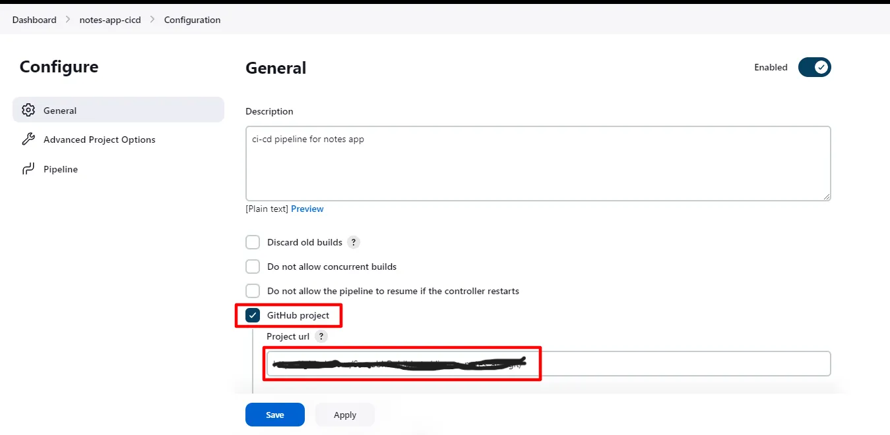

# containerized deployment
Automate the Process of deloying a containerized application

## 🚀 Project Overview
In this project, we will explore a DevOps project that involves deploying a Django notes app on an EC2 instance using Jenkins declarative CI/CD pipeline. We will leverage Docker containers and Docker Hub for containerization and image management. The project focuses on automating the deployment process, ensuring seamless integration and delivery of the application.

## 🔧 Problem Statement

## 💽 Techonology Stack
● **Server:** EC2

● **Container:** Docker

● **CI/CD:** Automate deployment using Jenkins

## 📌 Architecture Diagram

## 🌟 Project Requirements

## 🌟 Prerequisites

Before diving into the project, let’s ensure that we have the necessary prerequisites.

1. First of all, go to the AWS portal, and create a new instance.
Example: 
    · Name: jenkins-server
    · AMI: ubuntu.
    · Instance type: t2.micro (free tier).
    · Key pair login: Create > docker.pem.
    · Allow HTTP.
    · Allow HTTPS.
    (Download the .pem file.)

Click on Launch Instance, then connect to the EC2 instance and install following packages

2. [Docker installation](https://docs.docker.com/engine/install/)

3. Java installation
Install Openjdk-17-jre- by running the following command: ==sudo apt install openjdk-17-jre==

4. [Jenkins installation](https://www.jenkins.io/doc/book/installing/)

5. Docker compose 
run the following command: ==sudo apt-get install docker-compose==

Make sure you have this Installed on your system.

Additionally, we need to add users to the Docker group to grant them appropriate permissions. Run the following commands to add users to the Docker group:

>   sudo usermod -aG docker $USER
>   sudo usermod -aG docker jenkins
>   sudo reboot

Remember to reboot the system after making these changes.

* Now, we will allow “Inbound Rule” ports 8080 and 8000 for this machine from a security group. We can find the security group in the ec2 instance description.

* Now, Copy the Public Ip of the machine and paste it to the browser to access the Jenkins portal.

* We need an Administrator Password to unlock this. Run following command

* ==cat /var/lib/jenkins/secrets/initialAdminPassord==

* Now Click on, “Install Suggested Plugins”

* Now, Jenkins will ask us to create the First Admin User.

* You can get Jenkins homepage.

* Now, we will create a CI/CD pipeline.

* From Jenkins Dashboard, Click on “New Item”.

* Now, Add the name as
    Name: notes-app-cicd
    Project: Pipeline
    Click “Ok”.

Now we have to configure pipeline as follows
    
Dashboards > notes-app-cicd > configuration > general

Check✅Github project

[project url](https://github.com/cloudspaceacademy/containerization-deployment.git)

Check ✅GitHub hook trigger for GITScm polling

Put this basic Declarative pipeline code in script dialog box

>    pipeline {
>        agent any
>
>       stages {
>           stage('Clone Code') {
>                steps {
>                    echo 'Cloning the code'
>                }
>            }
>            stage('Build') {
>                steps {
>                    echo 'This is Build Stage'
>                }
>            }
>            stage('Push to Docker hub') {
>                steps {
>                    echo 'This is Test stage'
>                }
>            }
>            stage('Deployement') {
>                steps {
>                    echo 'Deploying container'
>                }
>            }
>        }
>    }

This code represents a Jenkins declarative pipeline, which is a popular way to define continuous integration and continuous deployment (CI/CD) workflows. Let’s go through each section and understand its purpose:

- ==**agent any**==: This line specifies that the pipeline can run on any available agent or executor in the Jenkins environment.

- ==**stages**==: This block defines the different stages of the pipeline. Each stage represents a logical step in the CI/CD process.

- ==**stage('Clone Code')**==: This stage is responsible for cloning the source code repository. In this case, the pipeline simply echoes the message "Cloning the code." In a real scenario, this stage would typically include commands to clone the repository using a version control system like Git.

-  ==**stage('Build')**==: This stage is responsible for building the application or project. Here, the pipeline echoes the message "This is the Build Stage." In a real scenario, this stage would typically include commands to compile the code, run tests, and generate build artifacts.

-  ==**stage('Push to Docker hub')**==: This stage is responsible for pushing the built artifacts to a Docker registry (such as Docker Hub). The pipeline echoes the message "This is the Test stage." In a real scenario, this stage would typically include commands to package the application into a Docker container and push it to the desired registry.

- ==**stage('Deployment')**==: This stage is responsible for deploying the application or container to the target environment. The pipeline echoes the message "Deploying container." In a real scenario, this stage would typically include commands to deploy the Docker container or perform any necessary configuration and setup for the application to run.

Each stage can have more complex logic and multiple steps, such as running shell commands, executing scripts, or invoking external tools.

By defining the pipeline stages and their associated steps, Jenkins can automate the entire CI/CD process, providing a consistent and reproducible workflow for building, testing, and deploying software applications.

* Now Click on Save button and start the build on pipeline page

* After getting success, you can see stages are green boxes with execution time.

## Developing the Notes App Code: To develop the Django notes app code, follow these steps:

Step 1: Clone the code
In the pipeline script, add the following code to clone the code from your repository:

git url: "https://github.com/SaurabhDahibhate/django_notes_app.git", branch: "master"

Step 2: Build the code
Add the following code to build the application and create docker image with tag

Step 3: Push to Docker Hub
Add the code to push the Docker image to Docker Hub:

For docker login in pipeline you have to create docker credentials and use them as environment variable

Create Credentials in Dashboard > Manage jenkins > Credentials > System > Global credentials

>    withCredentials([usernamePassword(credentialsId:"dockerhub-login",passwordVariable:"dockerhubpass",usernameVariable:"dockerhubuser" )]){
>    sh "docker tag notes-app ${env.dockerhubuser}/notes-app:latest"
>    sh "docker login -u ${env.dockerhubuser} -p ${env.dockerhubpass}" 
>    sh "docker push ${env.dockerhubuser}/notes-app:latest"
>   }

1. ==**withCredentials**==: This is a Jenkins pipeline step provided by the "Credentials Binding Plugin." It allows you to securely retrieve and use credentials within the block. In this case, we are retrieving the Docker Hub credentials using the ==usernamePassword== method.

2. ==**usernamePassword(credentialsId: "dockerhub-login", passwordVariable: "dockerhubpass", usernameVariable: "dockerhubuser")**==: This line retrieves the username and password from the Jenkins credentials store. The credentialsId parameter specifies the unique identifier of the stored Docker Hub credentials. The usernameVariable and passwordVariable parameters define the environment variables where the username and password will be stored, respectively. The environment variables are prefixed with env. in Jenkins, which is why you see env.dockerhubuser and env.dockerhubpass later in the code.

## 🚀 Instructions

Create New Repository and Clone it.

First we need to create a repository.

Navigate to GitHub -> Repositories -> Create Repository and give it a name.

Use the Clone URL to clone it to your local system.

Add your files to your local repository, commit your changes, and push your changes.

File has been pushed from our local repo to CodeCommit.

Create S3 Bucket

Navigate to S3 -> Create Bucket.

Uncheck “Block all Public Access” and acknowledge.

Navigate to your bucket -> Properties -> Edit Static website hosting

Enable Static website hosting and add your index document

Now we need to create a bucket policy. Got to Permissions and edit the bucket policy.

The following will allow everyone to access the bucket using the GetObject command,

Setup Pipeline.

Navigate to CodePipeline -> Create pipeline provide a name and click next.

Source Provider = AWS CodeCommit

Repository name = “Select your repo from the list”

Branch Name = **Master**

