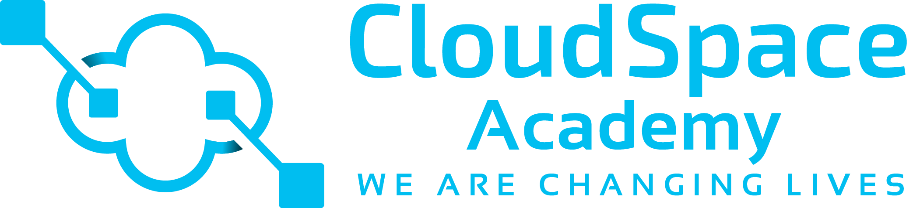

# **Welcome to Cloud Space**

 At **CloudSpace**, our students' success is our top priority. We understand it can be difficult to study alone once the BootCamp is over. CloudSpace is committed to providing you with the necessary support until you land that dream job. The **FREE follow-up program** is a dedicated place to keep learning with an industry leader DevOps instructor until you land a job. All this free of charge as long as you have completed the **AWS Cloud & DevOps BootCamp** with us. So after completing the 6 months AWS & DevOps Bootcamp, you can attend the Free Follow-up Program free of charge on a weekly basis to keep working on interview preparation and DevOps projects with an experienced instructor. So you will be allowed to attend this post-bootcamp until you land a job.

**Follow-Up Program Schedule: Thursdays (8PM-9PM) Interview Prep - Sundays (1PM-3PM) Projects Hands On**