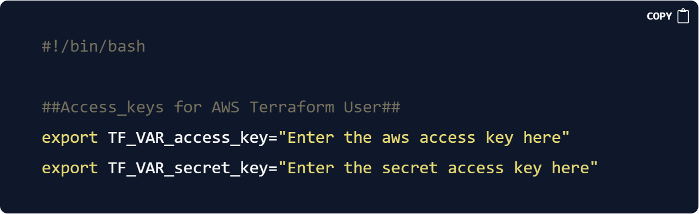

## 🚀 Project Overview
This project aims to build an advanced end-to-end CICD DevOps pipeline for a Java web application.
Our project is divided into two main parts:

1. The initial phase involves the installation and configuration of various tools and servers.

2. In the second phase, we will create an advanced end-to-end Jenkins pipeline with multiple stages.

## 🔧 Problem Statement
In the rapidly evolving landscape of software development, the implementation of Continuous Integration/Continuous Deployment (CICD) processes has become indispensable. For Java web applications, a robust CICD pipeline not only streamlines the development process but also ensures the delivery of high-quality, reliable software to end-users. This project aims to construct an advanced end-to-end CICD DevOps pipeline tailored specifically for Java web applications.

## 💽 Techonology Stack
● **AWS**

● **Git**

● **Gradle**

● **Ansible**

● **Terraform**

● **Jenkins**

● **SonarQube**

● **SonaType Nexus Repository Manager**

● **Kubernetes (kubeadm k8s cluster)**

● **Helm**

● **datree.io**

● **Slack**

## Prerequisites
1. AWS account
2. Terraform and Ansible should be installed and configured on your local computer

## Phase I: Installation and configuration
* We have used terraform config files to provision AWS resources and ansible playbooks to configure the instances as per our requirement, so you should know how to write terraform config files and ansible playbooks for understanding this phase of the project clearly. If you want to test the project then you can just clone the repo and run the commands which will automatically set up the required AWS resources.

* We need five servers to set up our CICD pipeline infrastructure. We have used Ubuntu as the base operating system for all our servers.

        1. Jenkins Server - jenkins
        ● This will host our jenkins application to implement our CI/CD pipelines.

        2.  SonarQube Server - sonar
        ● This server will host the SonarQube application. It is used for continuous inspection of code quality to perform automatic reviews with static analysis of code to detect bugs and code smells.

        3.  Nexus Repository server - nexus
        ●  Sonatype Nexus Repository Manager provides a central platform for storing build artifacts. This server will host our two private repositories one for storing docker images and another for storing helm charts.

        4. Kubernetes control plane node - k8s-master
        ●  This server will act as the control plane node for our kubernetes cluster.

        5. Kubernetes worker node - k8s-node1
        ●  The k8s-node1 server will act as a worker node for our kubernetes cluster
This concludes the brief description of the servers needed for our project. We can now proceed to Phase I.

# **Setup AWS account for Terraform**
1. To be able to set up the AWS resources with Terraform, we need to access AWS using **Access Keys**

2. Create a new user with administrator access to the AWS account

    * Goto **IAM > Users**, click on **Add users** and enter the user name and click **Next**.

    

    * On the next page, select **Attach policies directly** and attach the **AdministratorAccess** policy to the user. Click on **Next**, then click on **Create user**.

    

    

3. Create an AWS access key for the newly created user.

    * Navigate to **IAM > Users > tf-user**, select **Security credentials** and click on **Create access key**, select **Other** and click on **Next**. 

    * Enter a name for your access key and click on **Create access key** to create the key. 

    

    * Next, you will get an option to download the `.csv` file containing the access key and secret key or you can simply copy and store them in a safe place

    

4. Set environment variables on your local system for Terraform to access the AWS access key.

    * Create a file called `.envrc` in your home directory and write the commands to export the environment variables in it.

    

    ---

            #!/bin/bash
            ##Access_keys for AWS Terraform User##
            export TF_VAR_access_key="Enter the aws access key here"
            export TF_VAR_secret_key="Enter the secret access key here"

    ---

    Replace the data with your AWS access and secret keys and save the file. We have used the same variables in our terraform config files so make sure the name of the environment variables are exactly as mentioned in the code block above.

    * Edit your `.bashrc` file and add this line at the end `source ~/.envrc`
save the file and exit. 
    
# **Clone the Git repository**
```bash
git clone https://github.com/mandeepsingh10/cicd-setup.git
```


1. In the git repo, we have three directories.

    * **ansible_config** - contains all the ansible playbooks

    * **terraform_config** - contains all the terraform config files

    * **scripts** - contains miscellaneous scripts to automate some tasks

2. To provision AWS instances using Terraform, we need to specify a **public key** to access the resources, we can use our public key for this instead of creating a new pair as it will help us to directly access the EC2 instances without doing any additional configuration for ssh.

3. Copy your **public key** from `~/.ssh` directory to every Terraform configuration directory under `terraform_config` directory in the repository.

```bash
    cp $HOME/.ssh/id_rsa.pub $HOME/repos/cicd-setup/terraform_config/jenkins/publickey.pub
```
    My repository is present at `$HOME/repos` path, change that path as per your repo path and copy the public key as `publickey.pub` to all the directories `jenkins`, `master`, `nexus`, `node1` and `sonar` under `terraform_config` directory.
    
4. Now we will be able to provision the terraform resources by just running the `terraform apply` command.

# **Create AWS instances using Terraform**

1. First, we need to initialize all the directories where we have our Terraform configuration files.
```bash
 cd  $HOME/repos/cicd-setup/terraform_config/jenkins
 terraform init
```
        We need to initialize all the directories where we have our Terraform configuration files. To do this, navigate to each directory under `cicd/terraform_config` - `jenkins`, `master`, `nexus`, `node1`, and `sonar` - and run the command `terraform init`.

2. Next, we can try provisioning any one of the instances to check if our configuration is working as expected. To do this, navigate to the `Jenkins` directory and run the command `terraform plan`. If everything is set up correctly, it should display a message similar to this at the end:
