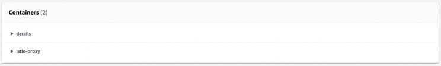
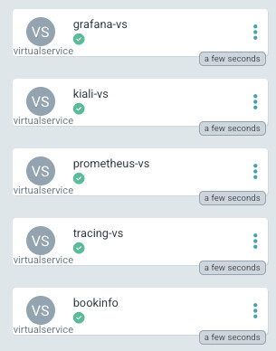
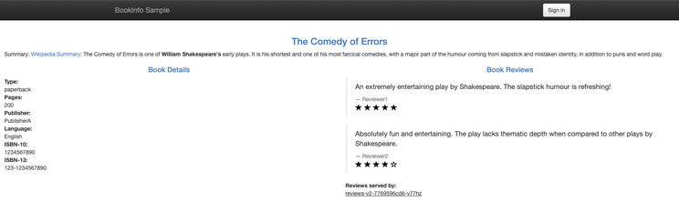

# Building a BookStore leveraging MicroServices. 

Step by Step BookStore DevOps Project.

## 🚀 Project Overview

Our DevOps initiative will focus on constructing an AWS environment, setting up a Kubernetes cluster through Amazon Elastic Kubernetes Service (EKS), and implementing an efficient process for continuous integration and deployment.

To lay the groundwork, we'll utilize the Bookinfo demonstration application. This application, consisting of multiple services, serves as an illustration of the intricacies inherent in a contemporary Microservices architecture.

- **GitHub Actions**: CI/CD platform integrated with GitHub for automating workflows.

- **AWS**: Cloud services provider for hosting applications and managing infrastructure.

- **EKS**: Amazon Elastic Kubernetes Service for deploying, managing, and scaling containerized applications.

- **ArgoCD**: Declarative GitOps continuous delivery tool for Kubernetes.

- **Terraform**: Infrastructure as Code (IaC) tool for provisioning and managing AWS resources.

- **ECR**: Amazon Elastic Container Registry for securely storing and managing Docker images.

- **Grafana**: Monitoring and visualization platform for metrics.

- **Prometheus**: Open-source monitoring and alerting toolkit.


We Will try to cover more Technologies and concept in this Article as possible.

## 🔧 Problem Statement

In today's rapidly evolving tech landscape, mastering DevOps tools and technologies is a top priority for IT professionals seeking to streamline workflows, foster collaboration, and expedite project delivery. Many individuals dedicate significant time and effort to completing courses on essential tools such as Terraform, ArgoCD, Istio, Kubernetes, and AWS, equipping themselves with the theoretical knowledge needed to revolutionize their development processes.

However, what often remains unaddressed is the significant challenge that arises once the courses are completed and the real-world integration journey begins. The struggle of connecting the dots between these powerful tools and effectively implementing them into a cohesive DevOps pipeline can be both daunting and perplexing.

This is a narrative that many of us have encountered firsthand – the initial excitement of acquiring new skills, followed by the frustration of translating those skills into tangible results within our projects. This workshop aims to address this gap by offering a comprehensive guide not only on the 'how' of using these tools but also on the 'how' within the context of a holistic DevOps approach.


## 💽 Techonology Stack

● **Application Integration:** Simple Notification Service (SNS)

● **Management & Governance:** CloudWatch.

● **Security, Identity & Compliance:** Secret Manager, SonarCloud(SonarQube)

● **CI/CD:** Automate deployment using AWS Code Pipeline, AWS CodeBuild, AWS CodeCommit, AWS CodeArtifact

## 📌 Architecture Diagram

**Microservices Diagram:**


**Technology Stack Diagram:**


## 🚦 Getting Started

### Prerequisites

Before you get started, make sure you have the following prerequisites in place:

- AWS account.
- AWS CLI.
- Docker.
- Git for cloning the repository.
- Any modern code editor (e.g., Visual Studio Code, Sublime Text, etc.)


To begin, you need an AWS account. If you don't have one, head to the AWS website and sign up for an account.

We need IAM user Access Key and Secret Key to be used with Terraform


Never disclose your Access Keys to anyone, and consistently utilize Secrets Managers.

## 📋 Table of Contents

- [Step-1: Clone the repository](#-Step-1-Clone-the-repository)
- [Step-2: Terraform Workflow](#-Step-2-Terraform-Workflow)
- [Step-3: Terraform Cloud Env Vars](#-Setup-3-Terraform-Cloud-Env-Vars)
- [Step-4: Install Required CLIs](#-Step-4-Install-Required-CLIs)
- [Step-5: Update Workflows with ECR URL](#-Step-5-Update-Workflows-with-ECR-URL)
- [Step-6: Update GitHub Repo with AWS Secrets](#-Step-6-Update-GitHub-Repo-with-AWS-Secrets)
- [Step-7: Deploy the Microservices Manifests](#-Step-7-Deploy-the-Microservices-Manifests)
- [Step-8: Istio Proxy uses Envoy](#-Step-8-Istio-Proxy-uses-Envoy)
- [Step-9: Test our BookStore Application](#-Step-9-Test-our-BookStore-Application)
- [Step-10: Monitoring](#-Step-10-Monitoring)

## ✨ Step-1-Clone-the-repository


- Please clone the project repository to your local machine. (You will need to be added to the CloudSpace organization before you can clone this.)

   ```bash
   git clone https://github.com/cloudspaceacademy/microservice-bookstore.git
   ```

## 🌟 Step-2-Terraform-Workflow


- In this workshop, we are using **Terraform Cloud** to let Terraform runs in a consistent and reliable environment.


- First create an account on Terraform Cloud if you don’t have one.


[Terraform Cloud Sign up](https://app.terraform.io/public/signup/account?trk=article-ssr-frontend-pulse_little-text-block) (Terraform Cloud has a Free License so no need to worry about pricing)


- Create your first organization and then Set up a workspace in Terraform Cloud. This will help manage your infrastructure as code and enable collaboration.


- Choose Version Control Workflow to work with your repository on Github which we will choose to do here.


- If you want to work with Terraform from your Terminal you can go for CLI-driven Workflow.


**Version Control Workflow > Connect to Github > choose the repository > configure Setting**


- In Advanced options configure the Terraform Working Directory terraform as our Terraform code is inside **terraform directory**


Before talking about the Terraform files, let's take time to read about Terraform — Best Practices  t[erraform-best-practices](https://www.terraform-best-practices.com/) and [Terraform — Best Practices](https://medium.com/devops-mojo/terraform-best-practices-top-best-practices-for-terraform-configuration-style-formatting-structure-66b8d938f00c)


Learn and Pick the right Terraform code Structure you need to follow.


Now let’s talk about the Terraform Directory before running our first plan and apply.


## terraform.tf :

This Terraform configuration block includes settings for Terraform Cloud (formerly known as Terraform Enterprise) and configures the AWS provider. Let's break down the code step by step:


   **1. Terraform Cloud Configuration:**

```bash
        terraform {
        cloud {
            organization = "devops-project-org"

            workspaces {
            name = "devops-project-workspace"
            }
        }
        }  
```  

   Let's breakdown the above code:

   
   In this part of the code, you are configuring Terraform Cloud settings:


   ***organization***: The name of the Terraform Cloud organization is set to "devops-project-org".


   ***workspaces***: Within the organization, a workspace is configured with the name "devops-project-workspace". A workspace in Terraform Cloud is an isolated environment for managing infrastructure.


   **2. AWS Provider Configuration:**


```bash
    provider "aws" {
    region = "us-east-1"
    }  
```  

   Let's breakdown the above code:


   This part of the code configures the AWS provider using the provider block:

   ***aws***: The name of the provider is "aws", indicating that this block configures resources from Amazon Web Services (AWS).


   ***region***: The AWS region is set to "us-east-1", which means resources created using this provider will be located in the US East (North Virginia) region.


## vpc.tf :

This Terraform code snippet is used to create a Virtual Private Cloud (VPC) in Amazon Web Services (AWS) using the ***terraform-aws-modules/vpc/aws*** module. Let's break down the code step by step:


   **1. Module Declaration**:

```bash
    module "vpc" {
    source = "terraform-aws-modules/vpc/aws"
    }    
```  
   Here, you are declaring a Terraform module named "vpc" using the module source ***terraform-aws-modules/vpc/aws***. This module is available in the Terraform registry and is designed to create a VPC with AWS resources.


   **2. Module Parameters**:

```bash
    name = "my-vpc"
    cidr = "10.0.0.0/16"  
``` 
   These parameters define the basic configuration of the VPC:

   ***name***: The name of the VPC will be set to "my-vpc".
   ***cidr***: The IP range for the VPC is set to "10.0.0.0/16".


   **3. Availability Zones and Subnets**:

```bash
    azs             = ["us-east-1a", "us-east-1b", "us-east-1c"]
    private_subnets = ["10.0.1.0/24", "10.0.2.0/24", "10.0.3.0/24"]
    public_subnets  = ["10.0.101.0/24", "10.0.102.0/24", "10.0.103.0/24"]  
``` 

   These parameters specify the availability zones and subnets for the VPC:

   ***azs***: The list of Availability Zones where the subnets will be created.

   ***private_subnets***: The list of private subnet CIDR blocks.

   ***public_subnets***: The list of public subnet CIDR blocks.

   **4. NAT and VPN Gateways**:

```bash
    enable_nat_gateway = true
    enable_vpn_gateway = true  
``` 

These settings enable NAT and VPN gateways for the VPC:

   ***enable_nat_gateway***: NAT gateways will be created for the private subnets.

   ***enable_vpn_gateway***: A VPN gateway will be created for the VPC.

   **5. Tags**:

```bash
    enable_nat_gateway = true
    enable_vpn_gateway = true  
``` 

   This block assigns tags to the resources created by the module. Tags are metadata that provide additional information about resources. Here, two tags are added: "Terraform" with the value "true" and "Environment" with the value "dev".


## ecr.tf :

This Terraform code snippet creates an Amazon Elastic Container Registry (ECR) repository and defines an output to display the repository URL. Let's break down the code step by step:


   **1. ECR Repository Resource**:


```bash
    resource "aws_ecr_repository" "my_repo" {
    name = "my-ecr-repo"
    image_tag_mutability = "MUTABLE"
} 
``` 

In this part of the code, you are creating an AWS ECR repository named "my-ecr-repo" using the ***aws_ecr_repository*** resource. The parameters you've set are:

   ***name***: The name of the ECR repository is set to "my-ecr-repo".

   ***image_tag_mutability***: The mutability of image tags is set to "MUTABLE", which means you can overwrite tags on images.


   **2. Output for Repository URL**:

```bash
  output "repository_url" {
  value = aws_ecr_repository.my_repo.repository_url
}  
``` 
This part of the code defines an output named "repository_url" that will display the URL of the ECR repository. The value of this output is set to the repository URL of the ***aws_ecr_repository.my_repo*** resource.


## eks.tf :

This Terraform code is used to create an Amazon Elastic Kubernetes Service (EKS) cluster using the ***terraform-aws-modules/eks/aws*** module. Let's break down the code step by step:

   **1. Module Declaration**:

```bash
    module "eks" {
    source  = "terraform-aws-modules/eks/aws"
    version = "~> 19.0"
}    
``` 

   This declares a Terraform module named "eks" and specifies the source from which to fetch the EKS module (terraform-aws-modules/eks/aws) along with a version constraint.

   **2. Cluster Configuration**: 

```bash
    cluster_name    = "my-cluster"
    cluster_version = "1.27"
    cluster_endpoint_public_access  = true  
``` 

These parameters configure the EKS cluster:

  ***cluster_name***: The name of the EKS cluster will be set to "my-cluster".
  ***cluster_version***: The Kubernetes version of the cluster will be "1.27".
  ***cluster_endpoint_public_access***: The Kubernetes API server endpoint will have public access.

  **3. Cluster Addons**:

```bash
    cluster_addons = {
    coredns = { most_recent = true }
    kube-proxy = { most_recent = true }
    vpc-cni = { most_recent = true }
    }     
``` 
This block configures cluster addons like CoreDNS, kube-proxy, and vpc-cni to use the most recent versions.

   **4. VPC and Subnet Configuration**:

```bash
    vpc_id                   = module.vpc.vpc_id
    subnet_ids               = module.vpc.private_subnets
    control_plane_subnet_ids = module.vpc.public_subnets     
``` 

These parameters specify the Virtual Private Cloud (VPC) and subnet details for the EKS cluster using outputs from another module (likely named "vpc").

   **5. Managed Node Group Configuration**:

```bash
eks_managed_node_group_defaults = {
  instance_types = ["m6i.large", "m5.large", "m5n.large", "t3.large"]
}

eks_managed_node_groups = {
  green = {
    use_custom_launch_template = false
    min_size     = 1
    max_size     = 10
    desired_size = 1
    instance_types = ["t3.large"]
    capacity_type  = "SPOT"
  }
}   
``` 

   This section configures an EKS managed node group named "green" with specific instance types, sizes, and capacity type (SPOT).

   **6. Fargate Profiles**:
   
```bash
    fargate_profiles = {
    default = {
        name = "default"
        selectors = [ { namespace = "default" } ]
    }
    }    
``` 

  This section defines a Fargate profile named "default" that targets the "default" namespace.
  
  ***aws-auth Configuration***: This section defines how IAM roles, users, and accounts will be mapped to Kubernetes RBAC roles for cluster access.

  **7. Tags**:

  ```bash
    tags = {
    Environment = "dev"
    Terraform   = "true"
    }      
``` 
 Tags are assigned to the created resources for organization and identification purposes.


## 🚀 Step-3-Terraform-Cloud-Env-Vars

We need to configure our organization with our Access Key and Secret Key and you can do it specific for the workspace or globally for the organization.

We will do it globally now for the organization by creating Variable Set

under the organization setting go to Variable sets and Create new one


   **1. Plan and Apply Terraform Code**:

   Now we are ready to start the Plan


   Review the Plan resources and then **Confirm & Apply**

   **2. Check AWS Resources Creation**:

   Verify in the AWS Management Console that your defined resources have been created as intended.

   **3. Deploy EKS-Manage EC2 Instance**:

   Of course it doesn’t have to be an EC2 instance you can use your Terminal.

   We will setup this instance to manage our EKS cluster from.


   - Deploy ubuntu instance

   - Install tools like **kubectl** (Kubernetes command-line tool), **aws-cli** (AWS Command Line Interface), and any other utilities you might need.

   - Install aws-cli


```bash
sudo apt install unzip	
curl "<https://awscli.amazonaws.com/awscli-exe-linux-x86_64.zip>" -o "awscliv2.zip"	
unzip awscliv2.zip
sudo ./aws/install
aws --version  
``` 


   - Install **kubectl**


```bash
curl -LO "<https://dl.k8s.io/release/$>(curl -L -s <https://dl.k8s.io/release/stable.txt>)/bin/linux/amd64/kubectl"	
Kubectl
curl -LO "<https://dl.k8s.io/$>(curl -L -s <https://dl.k8s.io/release/stable.txt>)/bin/linux/amd64/kubectl.sha256"
echo "$(cat kubectl.sha256) kubectl" | sha256sum --check
sudo install -o root -g root -m 0755 kubectl /usr/local/bin/kubectl
kubectl version --client   
``` 


   - Configure AWS Credentials

   - Run **aws configure** and provide your AWS Access Key ID, Secret Access Key, default region, and output format.

   - Configure **kubectl**


```bash
aws eks update-kubeconfig --name my-cluster --region us-east-1  
```

   - Test **kubectl** by running


```bash
kubectl get nodes

connect: connection refused    
```

**"Not working" 😕**


You need to troubleshoot why **kubectl** client can’t talk with the EKS endpoint

***Hint***: Something is blocking the requests to the EKS endpoint 

Now after You can talk to our EKS, you should add this fix to our Terraform code.

Now you can run

```bash
    kubectl get nodes

    ##OUTPUT##

    NAME                         STATUS   ROLES    AGE   VERSION
    ip-10-0-1-149.ec2.internal   Ready    <none>   64s   v1.27.3-eks-a5565ad           
```


## 💽 Step-4-Install-Required-CLIs


We installed the **AWS CLI, kubectl** Now we need to install **istioctl** and **argo CLI** and install the required k8s resources.


- **istioctl**

```bash
    curl -L <https://istio.io/downloadIstio> | sh -	
    cd istio-1.18.2/
    export PATH=$PWD/bin:$PATH
    istioctl install --set profile=demo -y 
```  

   **istioctl** is a command-line utility provided by Istio for installing and interacting with Istio deployments.

   **install** is the subcommand used to install Istio components.

   **-set profile=demo** specifies the installation profile. The "demo" profile includes a set of Istio components suitable for demonstration purposes.

- **argo CLI**

```bash
    curl -sSL -o argocd-linux-amd64 <https://github.com/argoproj/argo-cd/releases/latest/download/argocd-linux-amd64>	
    sudo install -m 555 argocd-linux-amd64 /usr/local/bin/argocd
    rm argocd-linux-amd64
    sudo install -m 555 argocd-linux-amd64 /usr/local/bin/argocd 
```  


- **Argo CD install**


```bash
    kubectl create namespace argocd	
    kubectl apply -n argocd -f <https://raw.githubusercontent.com/argoproj/argo-cd/stable/manifests/install.yaml>
    kubectl patch svc argocd-server -n argocd -p '{"spec": {"type": "LoadBalancer"}}'        
```  


 ***kubectl patch svc argocd-server -n argocd -p '{"spec": {"type": "LoadBalancer"}}'*** This command patches (updates) the Argo CD server service to change its service type to a LoadBalancer. This modification makes the Argo CD server accessible from outside the Kubernetes cluster via a load balancer's public IP address or DNS.

   - Argo CD intial admin secret


   ```bash
    argocd admin initial-password -n argocd  
   ```  


***It’s not a best practice to do it from the Terminal but I will give you a hint “Terrafrom”***


## 🔧 Step-5-Update-Workflows-with-ECR-URL

Modify your continuous integration workflows to include the ECR repository URL for Container image storage.


Under **.github/workflows/** you will find the Github Actions we will use to **build/push** our container images let’s break one workflow down.
   
   **details_workflow.yml** :

   ***Workflow Name and Trigger:name: Details Service Build, Push and Deploy***: Describes the name of the workflow.

   ***on***: Specifies the events that trigger the workflow.

   ***workflow_dispatch***: Allows manual triggering of the workflow.

   ***push***: Triggers the workflow when code changes are pushed to the repository's specified paths.

   ***Environment Variables:env***: Defines environment variables that will be available to the workflow steps.

   ***ECR_REGISTRY***: Specifies the Amazon ECR (Elastic Container Registry) registry URL.

   ***ECR_REPOSITORY***: Specifies the ECR repository name.

   ***Jobs:jobs***: Contains one or more jobs to be executed in sequence.

   ***build_and_push_image***: Describes a job named "build_and_push_image" that runs on an Ubuntu environment.

   ***runs-on***: Specifies the type of runner environment.

   ***steps***: Lists the individual steps within the job.

   ***Steps***:A series of steps, each with a specific name, purpose, and associated actions.

   ***uses*** refers to pre-built GitHub Actions that perform specific tasks.


   Here's what each step does:

   ***Checkout code***: Retrieves the repository's code using the actions/checkout GitHub Action.

   ***Configure AWS credentials***: Configures AWS credentials to access the ECR registry.

   ***Login to Amazon ECR***: Uses the aws-actions/amazon-ecr-login GitHub Action to log in to the ECR registry.

   ***Get short SHA***: Retrieves the short SHA hash of the latest Git commit.

   ***Build and push Docker image***: Builds a Docker image and pushes it to the specified ECR repository.

   ***Update Kubernetes Deployment Image***: Updates the image tag in a Kubernetes deployment YAML file to match the built Docker image.

   ***Commit and Push Changes***: Commits the changes made to the Kubernetes deployment YAML file and pushes them to the repository.


## 🚀 Step-6-Update-GitHub-Repo-with-AWS-Secrets


under **Setting > Secrets** and **Variables > Actions**


**Run Workflows**


Let’s the party begins


   - as we are using one repository we need our Github Workflow to update the new image

   - we should configure the Actions to be able to Read and Write to it’s repository

   - under Setting > Actions > General


The Workflows Will run if there is a push inside the services directories or manually, I will run them Manually Now.


You will find that I only added the Update Kubernetes Deployment Image part to **details_workflow.yml**

You need to complete the other Workflows

You need to check the **manifests/kubernetes** image part to mach it with the Workflows


**Check ECR Repo**


**Argo CD**


- add the repository to argo cd
- I will do it VIA SSH
- add the public ssh key to you Github account setting
- add the private ssh key to the argocd repository connect page


- deploy Namespaces to the cluster **staging** and **monitoring**
- under **manifests/networking/namespaces/** Add **NEW APP** in the argocd homepage
- follow the configuration
- Path: **manifests/networking/namespaces/**
- you can keep the Namespace field blank

## 💼 Step-7-Deploy-the-Microservices-Manifests


- under **argocd/apps/services** you will find Application CRD for argocd app to deploy our manifest resources to Kubernetes

- argocd homepage create **NEW APP**

- Application Name: app-services

- Project Name: default

- Sync Policy: Automatic

- [x] PRUNE RESOURCES

- [x] SELF HEAL

- [x] AUTO-CREATE NAMESPACE

- Repository URL:

- Path: **argocd/apps /services/**

- Cluster URL:

- Namespace: staging


You can check the Argo CD home page also you can check the resources in the EKS on AWS Console


If you check any POD in staging Namespace you will find that each one has two Containers





## 🔒 Step-8-Istio-Proxy-uses-Envoy

Envoy proxies are deployed as sidecars to services, logically augmenting the services with Envoy’s many built-in features, for example:


- Dynamic service discovery

- Load balancing

- TLS termination

- HTTP/2 and gRPC proxies

- Circuit breakers

- Health checks

- Staged rollouts with %-based traffic split

- Fault injection

- Rich metrics


**Istio Gateways and VirtualServices**:


- **Istio Gateway**: An Istio Gateway is a configuration resource that describes how external traffic (e.g., traffic from outside the Kubernetes cluster) is brought into the service mesh and how it's routed to services. It acts as an entry point into the mesh for incoming traffic. Gateways can be used to manage different protocols, such as HTTP, HTTPS, or TCP, and they can handle traffic based on hostnames, paths, and ports.

   - ***Hosts and Ports***: A Gateway is configured with a set of hosts and ports that it listens on. These could be domain names (for HTTP/HTTPS) or IP addresses and port numbers (for TCP).

   - ***TLS Termination***: Gateways can perform TLS termination, meaning they can handle SSL/TLS encryption and decryption for incoming traffic.

   - ***Virtual Services***: Gateways are often associated with VirtualServices to define how incoming traffic should be forwarded to specific services.


- **Istio VirtualService**: A VirtualService is a configuration resource that defines how traffic should be routed within the service mesh. It allows you to control the routing of traffic based on criteria like URI paths, headers, and more. VirtualServices are associated with one or more Istio Services and are often used in conjunction with Gateways to control how external traffic is routed to services.

   - ***Destination Rules***: VirtualServices can refer to DestinationRules, which define how traffic should be load-balanced between different versions of a service (canary deployments, blue-green deployments, etc.).
   - ***Traffic Splitting***: VirtualServices can split traffic between different versions of services based on weights or other criteria.
   - ***Match Conditions:*** VirtualServices define match conditions that determine which traffic is affected by the rules defined within them.
   - ***Fault Injection***: VirtualServices can also be used to inject faults or delays into requests for testing purposes.


   **Deploy Gateways and VirtualServices**

   - under **manifests/networking/gateways** Create Argo CD app to deploy them

   


## 🗄️ Step-9-Test-our-BookStore-Application


   - From the previous step you can browse to **istio-ingressgateway url/productpage**
   - To get the url

   ```bash
    kubectl get services -n istio-system
    NAME                   TYPE           CLUSTER-IP       EXTERNAL-IP                                                               PORT(S)                                                                      AGE
    istio-ingressgateway   LoadBalancer   172.20.27.197    ae271cd157c214ab888061809021225a-1922516608.us-east-1.elb.amazonaws.com   15021:32042/TCP,80:30092/TCP,443:31659/TCP,31400:31529/TCP,15443:32377/TCP   148m
   ```
   It will be the elb/dns under External-IP. We will open the application on our browser using that same link.




## 💻 Step-10-Monitoring

Under **argocd/apps/observability** Create NEW APP in monitoring Namespace


We have **Prometheus (Metrics Datastore), Loki (Logging), Jaeger (Tracing)** In a short words

- **Logging**: Recording events and activities for troubleshooting.

- **Metrics**: Measuring performance with numbers and graphs.

- **Tracing**: Following data flow to find performance issues.

**Grafana**

one of a many dashboard you can import and a lot to explore


**Kiali**

A comprehensive monitoring tool for Istio Service Mesh and also there is a lot to explore.


The dashboard can give you a Live fast response to any issue the could happen to any of your Microservice


## 📄 License

This project is licensed under the MIT License.
