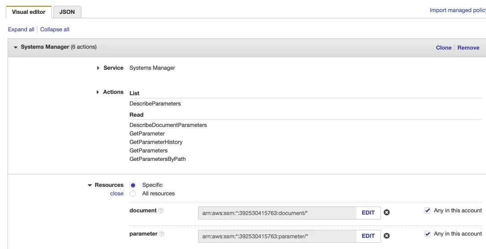
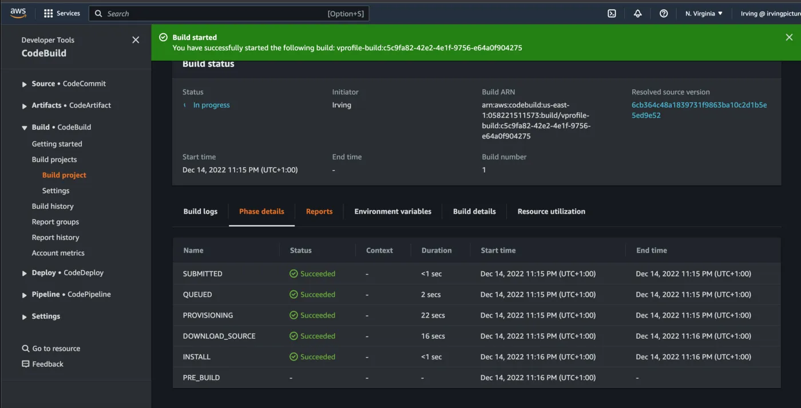

# Building a BookStore leveraging MicroServices. 

Step by Step BookStore DevOps Project.

## 🚀 Project Overview

Our DevOps initiative will focus on constructing an AWS environment, setting up a Kubernetes cluster through Amazon Elastic Kubernetes Service (EKS), and implementing an efficient process for continuous integration and deployment.

To lay the groundwork, we'll utilize the Bookinfo demonstration application. This application, consisting of multiple services, serves as an illustration of the intricacies inherent in a contemporary Microservices architecture.

- **GitHub Actions**: CI/CD platform integrated with GitHub for automating workflows.

- **AWS**: Cloud services provider for hosting applications and managing infrastructure.

- **EKS**: Amazon Elastic Kubernetes Service for deploying, managing, and scaling containerized applications.

- **ArgoCD**: Declarative GitOps continuous delivery tool for Kubernetes.

- **Terraform**: Infrastructure as Code (IaC) tool for provisioning and managing AWS resources.

- **ECR**: Amazon Elastic Container Registry for securely storing and managing Docker images.

- **Grafana**: Monitoring and visualization platform for metrics.

- **Prometheus**: Open-source monitoring and alerting toolkit.


We Will try to cover more Technologies and concept in this Article as possible.

## 🔧 Problem Statement

In today's rapidly evolving tech landscape, mastering DevOps tools and technologies is a top priority for IT professionals seeking to streamline workflows, foster collaboration, and expedite project delivery. Many individuals dedicate significant time and effort to completing courses on essential tools such as Terraform, ArgoCD, Istio, Kubernetes, and AWS, equipping themselves with the theoretical knowledge needed to revolutionize their development processes.

However, what often remains unaddressed is the significant challenge that arises once the courses are completed and the real-world integration journey begins. The struggle of connecting the dots between these powerful tools and effectively implementing them into a cohesive DevOps pipeline can be both daunting and perplexing.

This is a narrative that many of us have encountered firsthand – the initial excitement of acquiring new skills, followed by the frustration of translating those skills into tangible results within our projects. This workshop aims to address this gap by offering a comprehensive guide not only on the 'how' of using these tools but also on the 'how' within the context of a holistic DevOps approach.


## 💽 Techonology Stack

● **Application Integration:** Simple Notification Service (SNS)

● **Management & Governance:** CloudWatch.

● **Security, Identity & Compliance:** Secret Manager, SonarCloud(SonarQube)

● **CI/CD:** Automate deployment using AWS Code Pipeline, AWS CodeBuild, AWS CodeCommit, AWS CodeArtifact

## 📌 Architecture Diagram

**Microservices Diagram:**


**Technology Stack Diagram:**


## 🚦 Getting Started

### Prerequisites

Before you get started, make sure you have the following prerequisites in place:

- AWS account.
- AWS CLI.
- Docker.
- Git for cloning the repository.
- Any modern code editor (e.g., Visual Studio Code, Sublime Text, etc.)


To begin, you need an AWS account. If you don't have one, head to the AWS website and sign up for an account.

We need IAM user Access Key and Secret Key to be used with Terraform


Never disclose your Access Keys to anyone, and consistently utilize Secrets Managers.

## 📋 Table of Contents

- [Step-1: Clone the repository](#-Step-1-Clone-the-repository)
- [Step-2: Terraform Workflow](#-Step-2-Terraform-Workflow)
- [Step-3: Setup SonarCloud](#-Setup-SonarCloud)
- [Step-4: Store SonarCloud variables in System Manager Parameter Store](#-Step-3-Store-Sonar-in-SSM-Parameter-Store)
- [Step-5: AWS CodeBuild for SonarQube Code Analysis](#-Step-4-CodeBuild-for-SonarQube)
- [Step-6: AWS CodeBuild for Build Artifact](#-Step-5-CodeBuild-for-Build-Artifact)
- [Step-7: AWS CodePipeline and Notification with SNS](#-Step-6-CodePipeline-and-Notification-with-SNS)
- [Step-8: Validate CodePipeline](#-Step-8-Validate-CodePipeline)
- [Step-9: Create Elastic Beanstalk environment](#-Step-9-Create-Elastic-Beanstalk-environment)
- [Step-10: Create RDS MySQL Database](#-Step-10-Create-RDS-MySQL-Database)
- [Step-11: Update RDS Security Group](#-Step-11-Update-RDS-Security-Group)
- [Step-12: Use Beanstalk instance to connect RDS to deploy schemas](#-Step-12-Beanstalk-instance-to-connect-RDS-to-deploy-schemas)
- [Step-13: Update Code with pom & setting.xml](#-Step-13-Update-Code-with-pom-setting.xml)
- [Step-14: Build Job Setup](#-Step-14-Build-Job-Setup)
- [Step-15: Create Pipeline](#-Step-15-Create-Pipeline)
- [Step-16: SNS Notification](#-Step-16-SNS-Notification)
- [Step-17: Validate & Test](#-Step-17-Validate&Test)

## ✨ Step-1-Clone-the-repository


- Please clone the project repository to your local machine. (You will need to be added to the CloudSpace organization before you can clone this.)

   ```bash
   git clone https://github.com/waleedmagdy/devops_project.git
   ```

## 🌟 Step-2-Terraform-Workflow

- In this workshop, we are using **Terraform Cloud** to let Terraform runs in a consistent and reliable environment.


- First create an account on Terraform Cloud if you don’t have one.

[Terraform Cloud Sign up](https://app.terraform.io/public/signup/account?trk=article-ssr-frontend-pulse_little-text-block) (Terraform Cloud has a Free License so no need to worry about pricing)

- Create your first organization and then Set up a workspace in Terraform Cloud. This will help manage your infrastructure as code and enable collaboration.


- Choose Version Control Workflow to work with your repository on Github which we will choose to do here.

- If you want to work with Terraform from your Terminal you can go for CLI-driven Workflow.

**Version Control Workflow > Connect to Github > choose the repository > configure Setting**


- In Advanced options configure the Terraform Working Directory terraform as our Terraform code is inside **terraform directory**

Before talking about the Terraform files, let's take time to read about Terraform — Best Practices  t[erraform-best-practices](https://www.terraform-best-practices.com/) and [Terraform — Best Practices](https://medium.com/devops-mojo/terraform-best-practices-top-best-practices-for-terraform-configuration-style-formatting-structure-66b8d938f00c)

Learn and Pick the right Terraform code Structure you need to follow.

Now let’s talk about the Terraform Directory before running our first plan and apply.


**terraform.tf**

This Terraform configuration block includes settings for Terraform Cloud (formerly known as Terraform Enterprise) and configures the AWS provider. Let's break down the code step by step:

   **1. Terraform Cloud Configuration:**

```bash
        terraform {
        cloud {
            organization = "devops-project-org"

            workspaces {
            name = "devops-project-workspace"
            }
        }
        }  
```  
   Let's breakdown the above code:
   
   In this part of the code, you are configuring Terraform Cloud settings:

   ***organization***: The name of the Terraform Cloud organization is set to "devops-project-org".

   ***workspaces***: Within the organization, a workspace is configured with the name "devops-project-workspace". A workspace in Terraform Cloud is an isolated environment for managing infrastructure.

   **2. AWS Provider Configuration:**

    ```bash
    provider "aws" {
    region = "us-east-1"
    }  
   ```  
   Let's breakdown the above code:

   This part of the code configures the AWS provider using the provider block:

   ***aws***: The name of the provider is "aws", indicating that this block configures resources from Amazon Web Services (AWS).

   ***region***: The AWS region is set to "us-east-1", which means resources created using this provider will be located in the US East (North Virginia) region.


**vpc.tf**

This Terraform code snippet is used to create a Virtual Private Cloud (VPC) in Amazon Web Services (AWS) using the ***terraform-aws-modules/vpc/aws*** module. Let's break down the code step by step:


- Create an IAM user for CodeArtifact and configure aws CLI with its credentials. We will give Programmatic access to this user to enable use of aws cli and download credentials file.


   ```bash
    aws configure # provide iam user credentials
   ```  


- Run command get token as in the instructions.


   ```bash
    export CODEARTIFACT_AUTH_TOKEN=`aws codeartifact get-authorization-token --domain visualpath --domain-owner 392530415763 --region us-east-1 --query authorizationToken --output text`
   ```  
- Update pom.xml and setting.xml file with correct urls as suggested in instruction then push files to codeCommit.

   ```bash
    git add .
    git commit -m "message"
    git push origin ci-aws
   ```  
## 🚀 Step-3-Setup-SonarCloud

- Create an Account with SonarCloud. https://sonarcloud.io/ 

- From account avatar -> My Account -> Security. Generate token name as vprofile-sonartoken. Note the token.


- Next we create a project, + -> Analyze Project -> create project manually. Below details will be used in our Build.

   ```bash
    Organization: kubeirving-projects
    Project key: vprofile-repo8
   ```  

- Sonar Cloud is ready!


## 💽 Step-4-Store-Sonar-in-SSM-Parameter-Store


- Create parameters with the variables below.


   ```bash
    CODEARTIFACT_TOKEN	   SecureString	
    HOST                   https://sonarcloud.io
    ORGANIZATION           kubeirving-projects
    PROJECT                vprofile-repo8
    SONARTOKEN             SecureString
   ```  


## 🔧 Step-5-CodeBuild-for-SonarQube


- From AWS Console, go to CodeBuild -> Create Build Project. This step is similar to Jenkins Job.


   ```bash
    ProjectName: Vprofile-Build
    Source: CodeCommit
    Branch: ci-aws
    Environment: Ubuntu
    runtime: standard:5.0
    New service role
    Insert build commands from foler aws-files/sonar_buildspec.yml
    Logs-> GroupName: vprofile-buildlogs
    StreamName: sonarbuildjob
   ```  

- Update sonar_buildspec.yml file parameter store sections with the exact names we have given in SSM Parameter store.


- Add a policy to the service role created for this Build project -> find name of role from Environment, go to IAM add policy as below:





- Build your project.





- Check from SonarCloud too.


## 🚀 Step-6-CodeBuild-for-Build-Artifact

- From AWS Console, go to CodeBuild -> Create Build Project. This step is similar to Jenkins Job.


   ```bash
    ProjectName: Vprofile-Build-Artifact
    Source: CodeCommit
    Branch: ci-aws
    Environment: Ubuntu
    runtime: standard:5.0
    Use existing role from previous build
    Insert build commands from foler aws-files/build_buildspec.yml
    Logs-> GroupName: vprofile-buildlogs
    StreamName: artifactbuildjob
   ```

- It’s time to build project.


## 💼 Step-7-CodePipeline-and-Notification-with-SNS

- First we will create an SNS topic from SNS service and subscribe to topic with email.


- Confirm your subscription from your email.


- Next, create an S3 bucket to store our deploy artifacts.


- Create CodePipeline.


   ```bash
    Name: vprofile-CI-Pipeline
    SourceProvider: Codecommit
    branch: ci-aws
    Change detection options: CloudWatch events
    Build Provider: CodeBuild
    ProjectName: vprofile-Build-Aetifact
    BuildType: single build
    Deploy provider: Amazon S3
    Bucket name: vprofile98-build-artifact
    object name: pipeline-artifact
   ```

- Add Test and Deploy stages to your pipeline.
- Last step before running the pipeline is to setup Notifications.
- Go to Settings in CodePipeline -> Notifications.
- Time to run our CodePipeline.


## ✅ Step-8: Validate CodePipeline
- Make some changes in README file in your source code, once this change is pushed, CloudWatch will detect the changes and a notification event will trigger Pipeline.
## 🌱 Step-9-Create-Elastic-Beanstalk-environment

Create an environment using Sample application.

   ```bash
    Name: vprofile-app
    Capacity: LoadBalanced
        Min: 2
        Max: 4
    Security: Choose existing key-pair usedin previous steps
    Tags: 
        Name:Project
        Value: vprofile
   ```
## 🗄️ Step-10-Create-RDS-MySQL-Database

- Create an RDS service with the details below.
- Don’t forget the click View credential details to note down your password.

   ```bash
    Engine: MySQL
    version: 5.7
    Free-Tier
    DB Identifier: vprofile-cicd-mysql
    credentials: admin
    Auto generate password (will take note of pwd once RDS is created)
    db.t2.micro
    Create new SecGrp: 
    * Name: vprofile-cicd-rds-mysql-sg
    Additional Configurations: 
    * initial db name: accounts
   ```
## 🔒 Step-11-Update-RDS-Security-Group

Go to instances, find BeanStalk instance and copy its Secgrp ID. Update RDS SecGrp Inbound rules to allow access for Beanstalk instances on port 3306.
## 🗄️ Step-12-Beanstalk-instance-to-connect-RDS-to-deploy-schemas

- Although, SSH into your beanstalk instance to make changes is not a good practice as its better to create a new EC2 and perform these tasks, but for this project, we will make an exception.

- Go to Beanstalk SecGrp group, and change access to port 22 from Anywhere to MyIP. Install mysql client in this instance to be able to connect RDS. We also need to install git since we will clone our source code and get scripts to create schema in our database.

   ```bash
    sudo -i
    yum install mysql git -y
    mysql -h <RDS_endpoint> -u <RDS_username> -p<RDS_password>
    show databases;
    git clone https://github.com/rumeysakdogan/vprofileproject-all.git
    cd vprofileproject-all/
    git checkout cd-aws
    cd src/main/resources
    mysql -h <RDS_endpoint> -u <RDS_username> -p<RDS_password> accounts < db_backup.sql
    mysql -h <RDS_endpoint> -u <RDS_username> -p<RDS_password>
    use accounts;
    show tables;
   ```

Now go back to Beanstalk environment and under Configuration -> load balancer -> Processes , update Health check path to /login. Then apply changes.

## 💻 Step-13-Update-Code-with-pom-setting.xml

- Go to CodeCommit, select cd-aws branch. We will do the same updates that we did in ci-aws branch to the pom & settings.xml files. We can directory select file and Edit in CodeCommit, then commit our changes.

- For pom.xml, add the correct url from your code artifact connection steps:

   ```bash
    <repository>
            <id>codeartifact</id>
            <name>codeartifact</name>
        <url>https://visualpath-392530415763.d.codeartifact.us-east-1.amazonaws.com/maven/maven-central-store/</url>
        </repository>
   ```
for settings.xml, update below parts with correct url from code artifact.

   ```bash
    <profiles>
    <profile>
        <id>default</id>
        <repositories>
        <repository>
            <id>codeartifact</id>
        <url>https://visualpath-392530415763.d.codeartifact.us-east-1.amazonaws.com/maven/maven-central-store/</url>
        </repository>
        </repositories>
    </profile>
    </profiles>
    <activeProfiles>
            <activeProfile>default</activeProfile>
        </activeProfiles>
    <mirrors>
    <mirror>
        <id>codeartifact</id>
        <name>visualpath-maven-central-store</name>
        <url>https://visualpath-392530415763.d.codeartifact.us-east-1.amazonaws.com/maven/maven-central-store/</url>
        <mirrorOf>*</mirrorOf>
    </mirror>
    </mirrors>
   ```

## 🔧 Step-14-Build-Job-Setup

- Go to CodeBuild and change Source for Vprofile-Build & Vprofile-build-Artifact projects. Currently these projects are triggered from ci-aws branch, we will change branch to cd-aws.

**Create “BuildAndRelease” Build Project**

Then we create a new project called Build Project for deploying artifacts to BeanStalk.

   ```bash
    Name: Vprofile-BuildAndRelease
    Repo: CodeCommit
    branch: cd-aws
    Environment
    *Managed image: Ubuntu
    *Standard
    Image 5.0
    We will use existing role from previous Build project which has access to SSM Parameter Store
    Insert build commands: 
    * From source code we will get spec file under `aws-files/buildAndRelease_buildspec.yml`.
    Logs:
    *LogGroup:vprofile-cicd-logs
    *StreamnameBuildAndReleaseJob
   ```

We need to create 3 new parameters as used in BuilAndRelease_buildspec.yml file in SSM Parameter store. we have noted these values from RDS creation step, we will use them now.

   ```bash
    RDS-Endpoint: String
    RDSUSER: String
    RDSPASS: SecureString
   ```

Let’s run the project to know if successful!


**Create “SoftwareTesting” Build Project**

In this Build Project, we will run our Selenium Automation scripts and store the artifacts in S3 bucket.

First, we will create an S3 bucket.

   ```bash
    Name: vprofile-cicd-testoutput-rd (give a unique name)
    Region: it should be the same region we create our pipeline
   ```

Next, create a new Build project for Selenium Automation Tests. Create a new Build project with details below:

   ```bash
    Name: SoftwareTesting
    Repo: CodeCommit
    branch: seleniumAutoScripts
    Environment:
    * Windows Server 2019
    * Runtime: Base
    * Image: 1.0
    We will use existing role from previous Build project which has access to SSM Parameter Store
    Insert build commands: 
    * From source code we will get spec file under `aws-files/win_buildspec.yml`.
    * We need to update url part to our Elastic Beanstalk URL.
    Artifacts:
    *Type: S3
    * Bucketname: vprofile-cicd-testoutput-rd
    * Enable semantic versioning
    Artifcats packaging: zip
    Logs:
    *LogGroup: vprofile-cicd-logs
    *Streamname:
   ```
## ⛓️ Step-15-Create-Pipeline

Create CodePipeline with name vprofile-cicd-pipeline

   ```bash
    Source:
    * CodeCommit
    * vprofile-code-repo
    * cd-aws
    * Amazon CloudWatch Events

    Build
    * BuildProvider: CodeBuild
    * ProjectName: Vprofile-BuildAndRelease
    * Single Build

    Deploy
    * Deploy provider: Beanstalk
    * application: vprofile-app
    * Environment: vprofile-app-env
   ```

   ```bash
    We will Disable transitions and Edit pipeline to add more stages.
   ```

Add this stage in our codepipeline after “Source”:

   ```bash
    Name: CodeAnalysis
    Action provider: CodeBuild
    Input artifacts: SourceArtifact
    Project name: Vprofile-Build
   ```

Add second stage after CodeAnalysis:

   ```bash
    Name: BuildAndStore
    Action provider: CodeBuild
    Input artifacts: SourceArtifact
    Project name: Vprofile-Build-artifact
    OutputArtifact: BuildArtifact
   ```

Add third stage after BuildAndStore:

   ```bash
    Name: DeployToS3
    Action provider: Amazon S3
    Input artifacts: BuildArtifact
    Bucket name: vprofile98-build-artifact
    Extract file before deploy
   ```

Edit the ouput artifacts of Build and Deploy stages. Go to Build stage Edit Stage. Change Output artifact name as BuildArtifactToBean.

Go to Deploy stage, Edit stage. We change InputArtifact to BuildArtifactToBean.

Last Stage will be added after Deploy stage:

   ```bash
    Name: Software Testing
    Action provider: CodeBuild
    Input artifacts: SourceArtifact
    ProjectName: SoftwareTesting
   ```

Save and Release change. This will start our CodePipeline.

## 🔔 Step-16-SNS-Notification

Select your pipeline. Click Notify, then Manage Notification. We will create a new notification.

   ```bash
    vprofile-aws-cicd-pipeline-notification
    Select all
    Notification Topic: use same topic from CI pipeline
   ```
## 🧪 Step-17-Validate&Test

Time to test our pipeline.


We can check the app from browser with Beanstalk endpoint to view result.

## 📄 License

This project is licensed under the MIT License.
