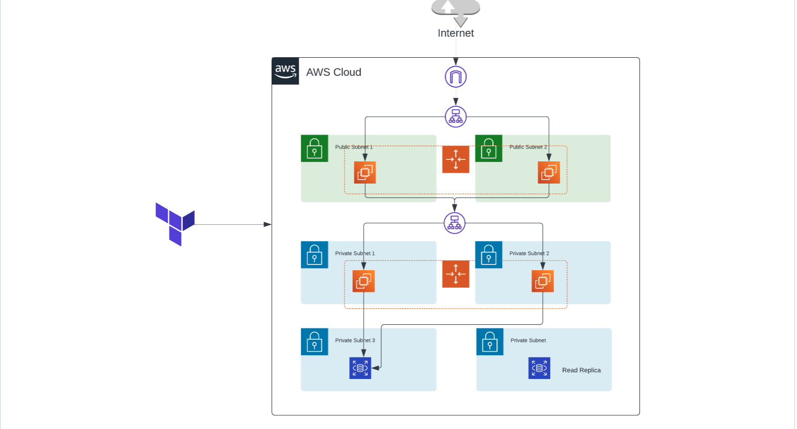
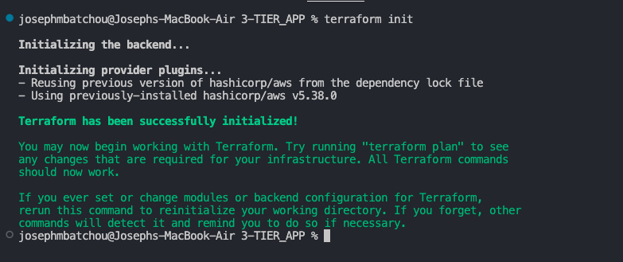
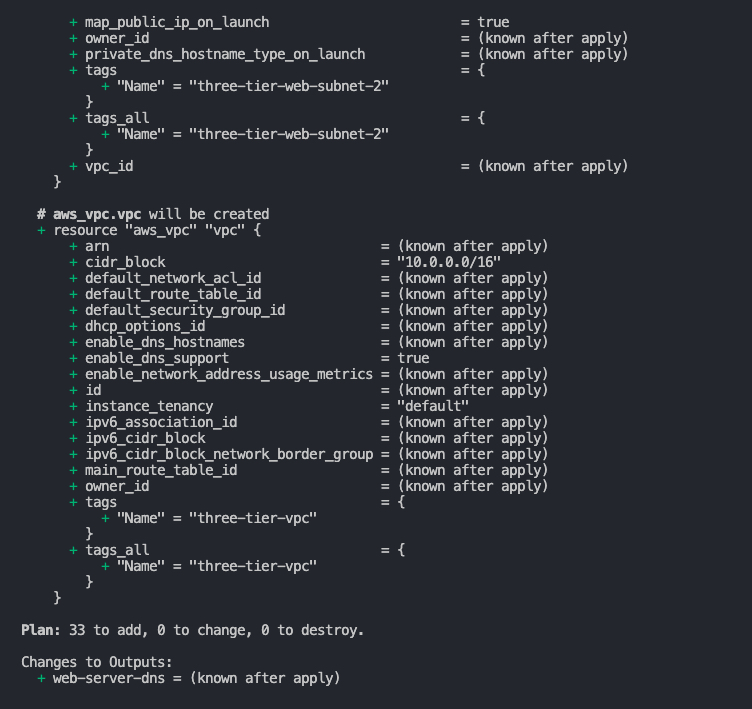
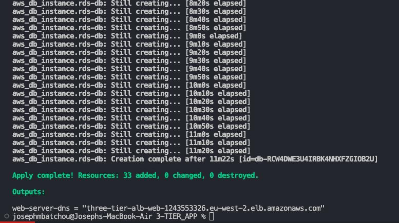
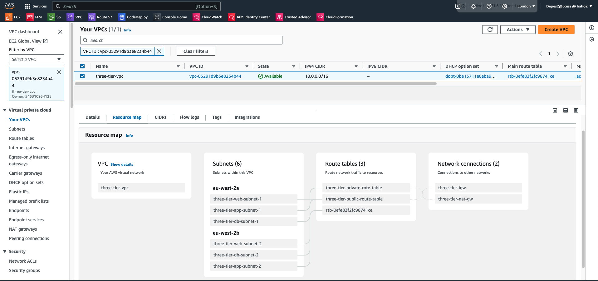
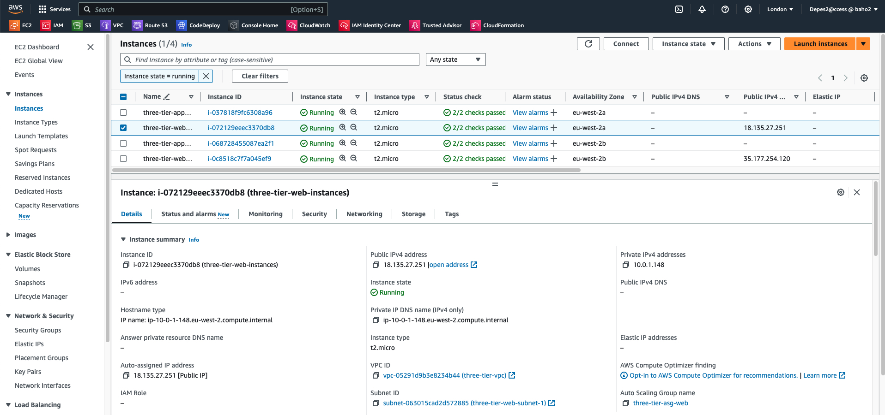
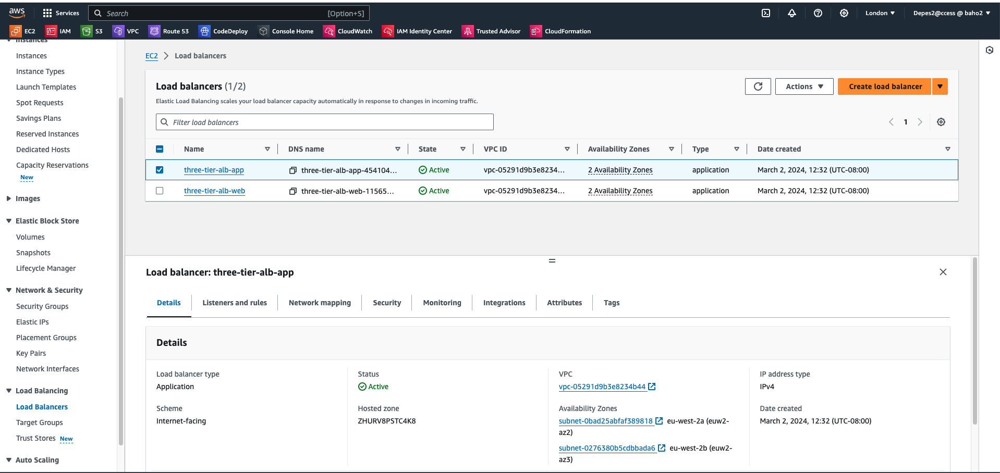
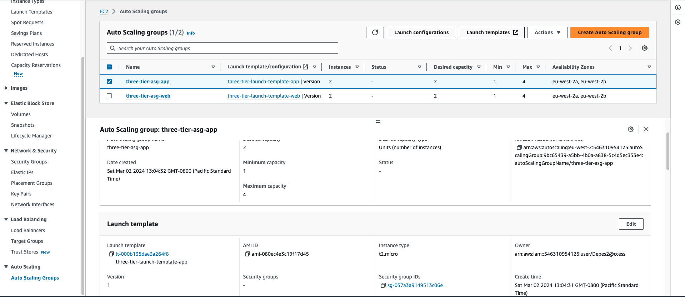
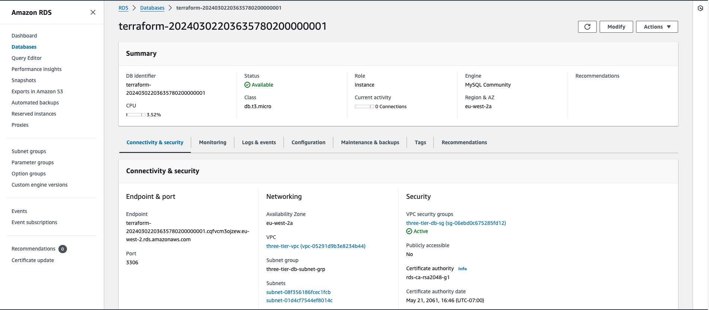
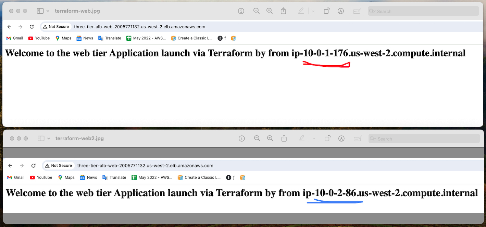

# Multi-Tier Architecture on AWS using Terraform


## 🚀 Overview:
The Multi-Tier Architecture project on AWS using Terraform aims to create a scalable and resilient infrastructure that leverages the power of Amazon Web Services (AWS) cloud platform. This project utilizes Terraform, an Infrastructure as Code (IaC) tool, to provision and manage the infrastructure components, enabling automation, repeatability, and scalability. The primary objective of this project is to design and deploy a multi-tier architecture on AWS that consists of multiple layers, including presentation, application, and database tiers. Each tier is deployed across multiple Availability Zones (AZs) for high availability and fault tolerance.


## 🔧 Problem Statement

Terraform is an IaC software tool that provides a consistent command line interface (CLI) workflow to manage hundreds of cloud services. Terraform codifies cloud APIs into declarative configuration files. In this specific case you need to create foundation Networking(VPC, Subnets, route table, IGW, NAT Gateway...), virtual machines (EC2 instances), databases (RDS), distribution of traffic (ELB) and Auto-scaling (ASG). Terraform will automatically use the configuration files to provide the infrastructure resources and run application needed. Terraform will use his deployment to provide all AWS needed elements avoiding us to use the console and it will automate the setup, ensuring consistency and reducing human error.

## 💽 Techonology Stack

 The architecture consists of the following three tiers:

- **VPC**: AWS VPC

- **AutoScaling**: AWS ASG

- **Elastic Load Balancer**: AWS ELB

- **Database**: AWS RDS

- **File Configuration**: Terraform

## 📌 Architecture Diagram



## 🌟 Project Requirements

Before you get started, make sure you have the following prerequisites in place:

- [Terraform](https://www.terraform.io/) installed on your local machine.
- AWS IAM credentials configured in your text editor. In this case we will use VSCODE.
- Git installed on your local machine and Github account set up [Github](https://www.github.com)
- Git for cloning the repository.

You must know and understand:

- **High Availability**: The architecture is designed for fault tolerance and redundancy. Reason why resources will be deploy across two avaibility zones to ensure resilience to failures. 
- **Scalability**: Easily scale the web and application tiers to handle varying workloads automaticaly based on demand.
- **Security**: Implementing security best practices such as Security groups and network ACLs are configured to ensure a secure and protected environment.

You must also know Terraform workflow


## 📋 Table of Contents

I - Terraform Configuration files
  
  [Step 1: Provider Configuration](#-Provider-configuration)

  [Step 2: Variables Configuration](#-variables-configuration)

  [Step 3: VPC Configuration](#-VPC-configuration)

  [Step 4: web tier Configuration](#-we-tier-configuration)

  [Step 5: Application tier Configuration](#-Applicayion-tier-configuration)

  [Step 6: Database tier Configuration](#-database-tier-configuration)

  [Step 7: Output Configuration](#-Output-configuration)

II - Instructions of Deployment

  [Step 8: Clone Repository](#-Clone-Repository)

  [Step 9: Initialize Folder](#-Initialize-Folder)

  [Step 10: Format Files](#-Format-Files)

  [Step 11: Validate Files](#-Validate-Files)

  [Step 12: Plan](#-Plan)

  [Step 13: Apply](#-Apply)

  [Step 14: Review of Resources](#-Review-Of-Resources)

  [Step 15: Destroy](#-Destroy)

## ✨Terraform Configuration files 

You need to write different files generating resources

Step 1:  Provider Configuration

Here we declare our cloud provider and we specify the region where we will be launching resources

- [provider Configuration](https://github.com/cloudspaceacademy/terraform-on-aws/blob/main/providers.tf)

Step 2:  Variables Configuration

This is where we declare all variables and thier value. It includes

- **Variables**: List of element that can vary or change. They can be reuse values throughout our code without repeating ourselves and help make the code dynamic
- **values**: values attributed to each variables.
- **secrets**: username and Password for the Database

Reminder: Never push terraform.tfvars and secrets.tfvars file on Github

We have 

- [variables Configuration](https://github.com/cloudspaceacademy/terraform-on-aws/blob/main/variables.tf)
- [value Configuration](https://github.com/cloudspaceacademy/terraform-on-aws/blob/main/terraform.tfvars)
- [Secrets Configuration](https://github.com/cloudspaceacademy/terraform-on-aws/blob/main/secret.tfvars)

Step 3: VPC Configuration

This is where you create the basement, foundation and networking where all the resources will be launch. It includes VPC, Subnets, IGW, NatGateway, EIP and Route tables

- [VPC Configuration](https://github.com/cloudspaceacademy/terraform-on-aws/blob/main/vpc.tf)

Step 4:  Web Tier Configuration

The Web Tier is the entry point for incoming user requests. Resources are launched in the public subnets. It typically includes:

- **Web Servers**: These run your application code that contains the apache which will deploy the index.html located in the user data.
- **Load Balancer**: Distributes traffic across multiple web servers running in the public subnets.
- **Auto Scaling**: Automatically adjusts the number of web servers based on traffic.
- **Security Groups**: Controls incoming and outgoing traffic from outside to the web servers.

Web tier configuration files are :

- [Web ASG Configuration](https://github.com/cloudspaceacademy/terraform-on-aws/blob/main/web_asg.tf)
- [Web ELB Configuration](https://github.com/cloudspaceacademy/terraform-on-aws/blob/main/web_alb.tf)


Step 5: Application Tier Configuration

The Application Tier hosts the application servers responsible for running business logic and interacting with the database tier. Key components include:

- **Application Servers**: These run your application code and can be horizontally scaled.
- **Load Balancer**: Distributes traffic to the application servers running in the private subnets.
- **Auto Scaling**: Automatically adjusts the number of web servers based on traffic.
- **Security Groups**: Controls incoming and outgoing traffic from the web servers to the application servers.

Application Tier Configuration files are: 

- [App ASG Configuration](https://github.com/cloudspaceacademy/terraform-on-aws/blob/main/app_asg.tf)
- [App ELB Configuration](https://github.com/cloudspaceacademy/terraform-on-aws/blob/main/app_alb.tf)

Step 6:  Database Tier Configuration

The Database Tier stores and manages our application data. We use Amazon RDS for a managed, a highly available and scalable database to store application data. Key components include:

- **Subnets groups**: List of subnets wherether Server databases will run.
- **Amazon RDS**: A managed database service for MySQL/PostgreSQL/SQL Server databases.
- **Security Groups**: Control incoming and outgoing traffic to the database.

Database Tier Configuration file:

- [DB Configuration](https://github.com/cloudspaceacademy/terraform-on-aws/blob/main/db.tf)


Step 7: Output Configuration

Know as Output Value : it is a convenient way to get useful information about your infranstructure printed on the CLI. It is showing the ARN, name or ID of a resource. In this case we are bringing out the DNS name of the web application Load balancer.  

- [Output Configuration](https://github.com/cloudspaceacademy/terraform-on-aws/blob/main/outputs.tf)

## 💼 Instructions of Deployment

Follow these steps to deploy the architecture:

Step 8: Clone Repository:

Clone the repository in your local machine using the command "git clone" 

   ```bash
   git clone https://github.com/cloudspaceacademy/terraform-on-aws.git
   ```

Step 9: Initialize Folder

Initialize the folder containing configuation files that were clone to Terraform and apply the configuration by typing  the following command
  
   ```bash
   terraform init
   ```

   You must see this image

   

Step 10: Format Files

Apply any changes on files and Review the changes and confirm the good format with command:
   
   ```bash
   terraform fmt
   ```
   
Step 11: Validate Files

Ensure that every files are syntactically valid and ready to go with the command: 
   
   ```bash
   terraform validate
   ```

   If everything is good you will have something like this 

   

Step 12: Plan

Create an excution plan to provide the achievement of the desired state. It Check and confirm the numbers of resources that will be create. Use command:
   
   ```bash
   terraform plan
   ```
   
   The list of all resources in stage of creation will appear and you can see all properties(arguments and attributs) of each resouces

    

Step 13: Apply

Bring all desired state resources on life. It Launch and create all resources listed in the configuration files. The command to perform the task is:  
   
   ```bash
   terraform apply -auto-approve
   ```

You will be prompt to type the username and password for the database. After you enter those criticals data the process of creation will start and you will be able to see which resourse is on the way to be create and the time it taking to create.

     

At the end you will recieve a prompt message showing all resources status: created, changed and the numbers of them. 

     

Step 14: Review of resources

Go back on the console and check all actual state resources one by one to see. You will have

  
VPC

    

   
Instances running

    

   
Application Load Balancer

    

   
Autoscaling groups 


    

  
Database 


    

  
Web page 


    


Step 15: Destroy

Destroy the terraform managed infrastructure meaning all resourcescreated will be shut down. This action can be done with the command "terraform destroy" 
   
   ```bash
   terraform destroy -auto-approve
   ```
   

At the end you will recieve a prompt message showing all resources has been destroyed

     


## 📄 License

This project is licensed under the CloudSpace Academy License
