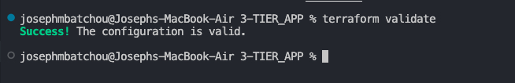
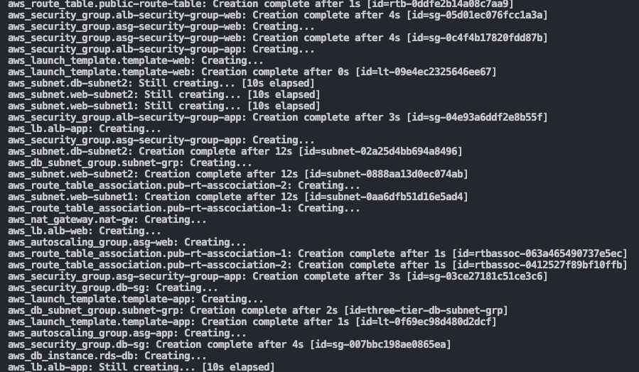
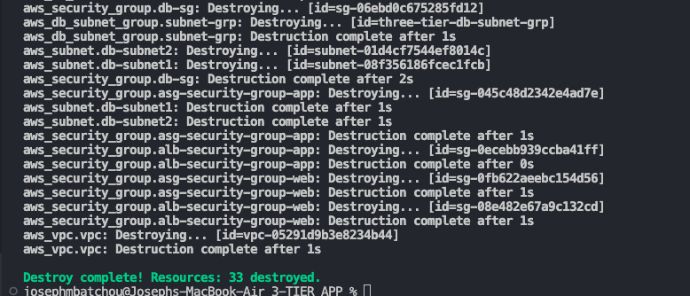

# Multi-Tier Architecture on AWS using Terraform


## 🚀 Overview:
The Multi-Tier Architecture project on AWS using Terraform aims to create a scalable and resilient infrastructure that leverages the power of Amazon Web Services (AWS) cloud platform. This project utilizes Terraform, an Infrastructure as Code (IaC) tool, to provision and manage the infrastructure components, enabling automation, repeatability, and scalability. The primary objective of this project is to design and deploy a multi-tier architecture on AWS that consists of multiple layers, including presentation, application, and database tiers. Each tier is deployed across multiple Availability Zones (AZs) for high availability and fault tolerance.


## 🔧 Problem Statement

Terraform is an IaC software tool that provides a consistent command line interface (CLI) workflow to manage hundreds of cloud services. Terraform codifies cloud APIs into declarative configuration files. In this specific case you need to create foundation Networking(VPC, Subnets, route table, IGW, NAT Gateway...), virtual machines (EC2 instances), databases (RDS), distribution of traffic (ELB) and Auto-scaling (ASG). Terraform will automatically use the configuration files to provide the infrastructure resources and run application needed. Terraform will use his deployment to provide all AWS needed elements avoiding us to use the console and it will automate the setup, ensuring consistency and reducing human error.

## 💽 Techonology Stack

 The architecture consists of the following three tiers:

- **VPC**: AWS VPC

- **AutoScaling**: AWS ASG

- **Elastic Load Balancer**: AWS ELB

- **Database**: AWS RDS

- **File Configuration**: Terraform

## 📌 Architecture Diagram


## 🌟 Project Requirements

Before you get started, make sure you have the following prerequisites in place:

- [Terraform](https://www.terraform.io/) installed on your local machine.
- AWS IAM credentials configured in your text editor. In this case we will use VSCODE.
- Git installed on your local machine and Github account set up [Github](https://www.github.com)
- Git for cloning the repository.

You must know and understand:

- **High Availability**: The architecture is designed for fault tolerance and redundancy. Reason why resources will be deploy across two avaibility zones to ensure resilience to failures. 
- **Scalability**: Easily scale the web and application tiers to handle varying workloads automaticaly based on demand.
- **Security**: Implementing security best practices such as Security groups and network ACLs are configured to ensure a secure and protected environment.

You must also know Terraform workflow


## 📋 Table of Contents

- [Step 1: Terraform Configuration files](#-terraform-configuration-files)
- [Step 2: Instructions of Deployment](#-Instructions-of-Deployment)
- [Step 3: Conclusion](#-conclusion)
- [Step 4: License](#-license)

## ✨Terraform Configuration files 

You need to write different files generating resources

1 - Provider

Here we declare our cloud provider and we specify the region where we will be launching resources

- [provider Configuration](providers.tf)

2 - Foundation and Networking

This is where you create the basement where all the resources will be launch. It includes VPC, Subnets, IGW, NATGateway, EIP and Route table

- [VPC Configuration](vpc.tf)

3 - Web Tier

The Web Tier is the entry point for incoming user requests. Resources are launched in the public subnets. It typically includes:

- **Web Servers**: These run your application code that contains the apache which will deploy the index.html located in the user data.
- **Load Balancer**: Distributes traffic across multiple web servers running in the public subnets.
- **Auto Scaling**: Automatically adjusts the number of web servers based on traffic.
- **Security Groups**: Controls incoming and outgoing traffic from outside to the web servers.


- [Web ASG Configuration](web_asg.tf)
- [Web ELB Configuration](web_alb.tf)


4 - Application Tier

The Application Tier hosts the application servers responsible for running business logic and interacting with the database tier. Key components include:

- **Application Servers**: These run your application code and can be horizontally scaled.
- **Load Balancer**: Distributes traffic to the application servers running in the private subnets.
- **Auto Scaling**: Automatically adjusts the number of web servers based on traffic.
- **Security Groups**: Controls incoming and outgoing traffic from the web servers to the application servers.

Application Tier Configuration

- [App ASG Configuration](app_asg.tf)
- [App ELB Configuration](app_alb.tf)

5 - Database Tier

The Database Tier stores and manages our application data. We use Amazon RDS for a managed, a highly available and scalable database to store application data. Key components include:

- **Subnets groups**: List of subnets wherether Server databases will run.
- **Amazon RDS**: A managed database service for MySQL/PostgreSQL/SQL Server databases.
- **Security Groups**: Control incoming and outgoing traffic to the database.

Database Tier Configuration

- [DB Configuration](db.tf)

6 - Variables

This is where we declare all variables and thier value. It includes

- **Variables**: List of element that can vary or change. They can be reuse values throughout our code without repeating ourselves and help make the code dynamic
- **values**: values attributed to each variables.
- **secrets**: username and Password for the Database

Reminder: Never push terraform.tfvars and secrets.tfvars file on Github

We have 

- [variables Configuration](variables.tf)
- [value Configuration](terraform.tfvars)
- [Secrets Configuration](secrets.tfvars)

7 - Output

Know as Output Value : it is a convenient way to get useful information about your infranstructure printed on the CLI. It is showing the ARN, name or ID of a resource. In this case we are bringing out the DNS name of the web application Load balancer.  

- [Output Configuration](outputs.tf)

## 💼 Instructions of Deployment

Follow these steps to deploy the architecture:

1. Clone the repository:

   ```bash
   git clone https://github.com/mathesh-me/multi-tier-architecture-using-terraform.git
   ```

2. Initialize the folder Terraform and apply the configuration by typing command:
  
   ```bash
   terraform init
   ```

   You must see this image

   

3. Apply any changes on files and Review the changes and confirm the good format with command:
   
    ```bash
   terraform fmt
   ```
   
4. Ensure that every files are good and ready to go with the command: 
   
    ```bash
   terraform validate
   ```

   If everything is good you will have something like this 

   

5. Check and confirm the numbers of resources that will be created by using command:
   
   ```bash
   terraform plan
   ```
   
   The list of all resources in stage of creation will appear and you can see all properties(arguments and attributs) of each resouces

    

6. Launch the creation of all resources with the command:  
   
    ```bash
   terraform apply -auto-approve
   ```

   You will be prompt to type the username and password for the database. After you enter those criticals data the process of creation will start and you will be able to see which resourse is on the way to be create and the time it taking to create.

     

   At the end you will recieve a prompt message showing all resources status: created, changed and the numbers of them. 

     

7. Go back on the console and check all resources one by one to see. You will have

   VPC: 

    

   Instances running: 

    

   Application Load Balancer: 

    

   Autoscaling groups: 

    

   Database: 

    

   Web page: 

    

8. Destroy all resources after with the command:
   
    ```bash
   terraform destroy -auto-approve
   ```
   
   At the end you will recieve a prompt message showing all resources has been destroyed

     


## 🤝 Conclusion

The Multi-Tier Architecture project on AWS using Terraform offers a scalable, resilient, and automated solution for deploying multi-tier applications on the AWS cloud platform. By leveraging Terraform and AWS services, the project enables developers to quickly provision, manage, and scale infrastructure resources, facilitating efficient application deployment and operations.

## 📄 License

This project is licensed under the CloudSpace Academy License